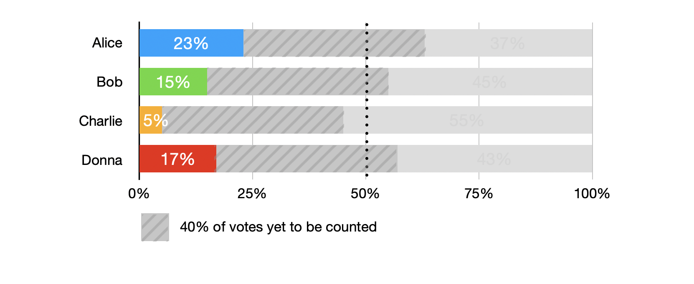
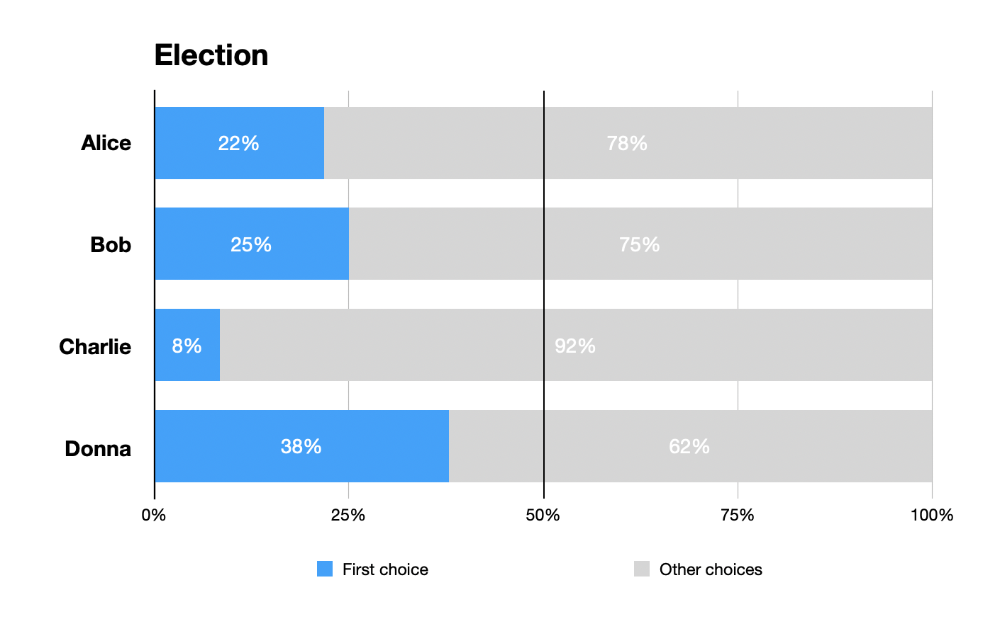
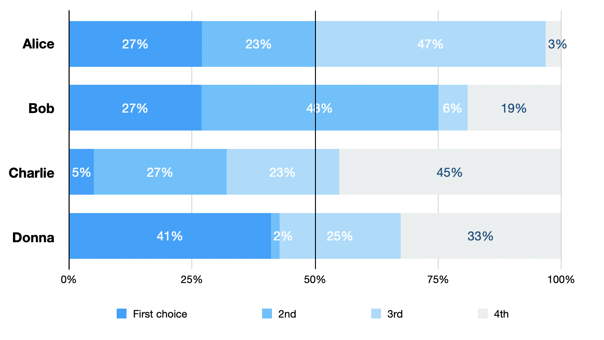
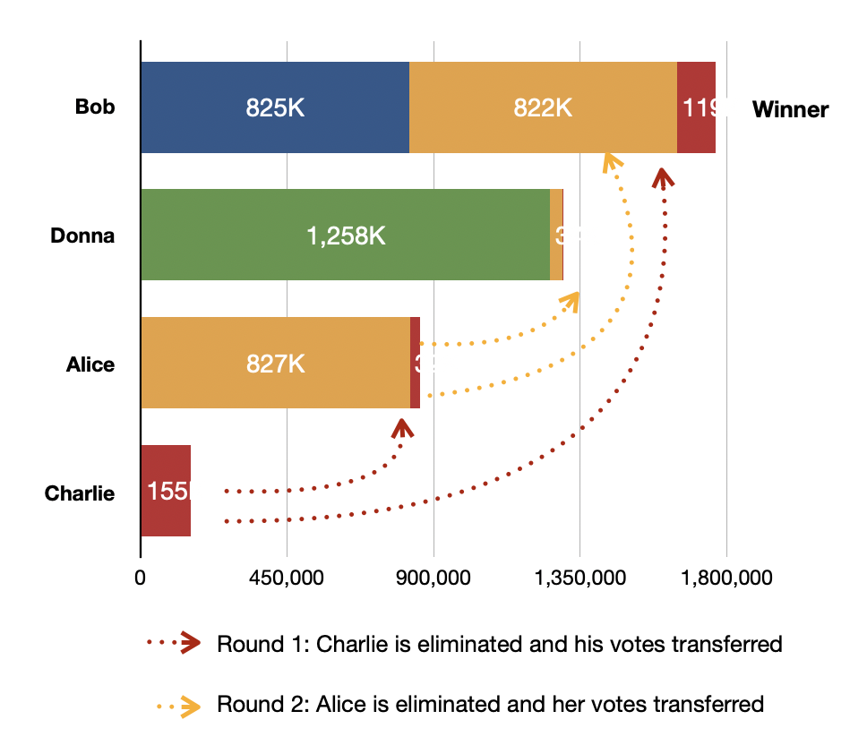
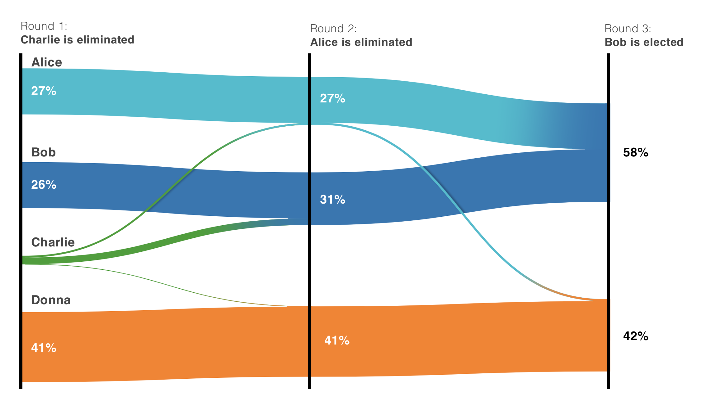
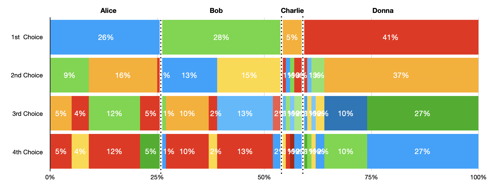
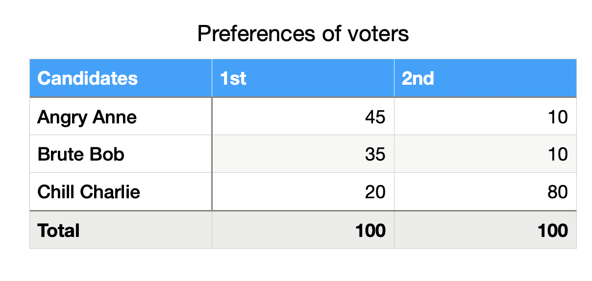
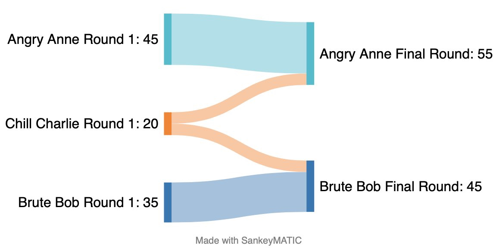

Democracy is the heart of modern civilization, elections are the heart of democracy, and a voting system is at the heart of elections. While we can’t blame all modern illnesses on a improper vote counting algorithm, a failed one certainly ripples back its problem on all society. Luckily this isn’t just an academic argument anymore, with more countries and states experimenting with systems beyond First Past the Post and Two Round Systems. Unfortunately, many of those are now migrating to [Instant run Off voting](https://en.wikipedia.org/wiki/Instant-runoff_voting), which has so many flaws that it can spoil the whole movement for better voting.

Much has been written on the failures of “[First Past the Post](https://en.wikipedia.org/w/index.php?title=Special:Search&search=First-past-the-post+voting)” (the american presidency system) and the [Two round systems](https://en.wikipedia.org/wiki/Two-round_system) (common in south america, asia and europe), not so much has been written about the failures of IRV, which has been recently started being implemented in Alaska and New York City and other places.

**Wait, isn’t Ranked Choice Voting and Instant-Runoff Voting the same thing?**

No! Ranked choice is how the ballot is presented. Instant runoff is how the ballot is counted. Ranked Choice, can be a great way to express voter’s preferences and it depends heavily on the context (Approval voting and score voting can be perfectly appropriate depending on your goals too). Instant Run-off is specifically how you take these ranked ballots and find a winner.

Ranked Choice is often promoted as a way to eliminate strategic voting and extremism in elections by picking a moderate candidate that appeals to most people, even if they were not the most popular first choice. _While this can be true of ranked choice voting, it’s definitely not the case on IRV, as you’ll see below._

**Voting needs to be simple to understand and predictable**

It’s not enough that voters be educated how a voting system works. It must be simple for them to understand the current state of all voter’s preferences and the result should be obvious and intuitive. And it goes deeper than just announcing the winner, as votes have many stages:

- **Before the election:** Polling is a very important part of the election. It’s where voters can understand how everyone else besides them think and how likely each candidate is to win. It helps everyone think strategically, not only on who they’ll vote, but what any given candidate needs to do, and who they need to talk to, to win
- **During the election count:** during the count (even if it’s a fast electronic counting system) it’s crucial that voters be informed on the current state of votes, when a candidate still has chance to turn the game around and when a candidate becomes mathematically elected. Surprises in an election count lead to less trust in the system.
- **After the election:** the clear state of voting is essential for legitimacy of an election. If there’s a surprising turn of events, all voters must be able to understand what exactly happened, and not simply be asked to “trust the algorithm”. It’s also important as lessons learned for the future: which constituencies should be addressed on the next election, what the losing candidate could’ve done to revert the game.

<figure>

<figcaption>Example of in-count vote visualization. It's clear that it's impossible for Charlie to reach 50% and it's looking increasingly unlikely Bob will be ahead.</figcaption>
</figure>

**Instant run-off voting is the opposite of that. It’s unpredictable and extremely hard to visualize the current state of all votes.**

Let’s try a similar example as before. If we were to have show a poll of the first choice between these four candidates we might see something like this:

<figure>

</figure>

It seems Donna is on the lead, but this graph doesn’t show anything about second or third preferences. We could add them like this:

<figure>

</figure>

This chart clearly paints a different picture! While Donna is in the lead as the first choice, it barely has votes for second choice and very few votes for the third choice. It’s unlikely that she will win this election. But you can’t really tell who would, because this chart doesn’t tell you how the secondary preferences are distributed.

Another option is to present the calculated end result of the polls, often in an animated version that will show you some information like this:

<figure>

</figure>

This does a much better job at showing the result, but not much about the state. It tells nothing about the secondary preferences of Donna and Bob voters. If you are an Alice supporter, who should you be convincing to change their mind? More precisely, what was the process that made these votes be redistributed?

It’s common to explain the proccess in which a winner is chosen with IRV using a Sankey Diagram:

<figure>

</figure>

But while Sankey Diagrams are great tools to teach how the voting took place and how IRV works, they still don’t show the current state of voting. In this example, Donna votes are not being counted for any other candidate, yet she cannot win. If Donna is eliminated in an earlier round, or if their supporters move her to a second preference rather than a first, how significantly will the result change? In some cases it could change a lot!

<figure>

<figcaption>A "DNA" graph of all votes. Contains all information but it's not easy to parse and if more candidates were present it would be basically unreadable.</figcaption>
</figure>

The above “DNA map” shows the full picture of all voters. Looking at it closely, you can infer that while Alice and Bob voters support each other, most Donna’s voters actually prefer Charlie. This could have a drastic effect on the race, but these preferences are not being counted towards the final round. Which means that if Donna + Charlie supporters strategically switch their preferences to be Charlie + Donna voters, then Charlie would jump from last place to the forefront of the next round, eliminating Bob (which was the previous winner!), and eventually winning the overall election.

The previous winner is now eliminated on the second round, the previous last place is now the winner. No voter preference really changed, Bob didn’t lose a single supporter, all from a simple strategic voting change from voters who already supporter Charlie. That this would be possible is absolutely not inferred from looking at the previous Sankey diagram and very hard to see (unless you do some counting in your head) from looking at the diagram above.

**An election whose results are surprising, hard to understand and predict and can dramatically change with strategic voting. This is the opposite of what you want in a voting system.**

**_But at least Ranked Choice voting helps eliminate extremism on politics!_**

Not necessarily. At least not with Instant Runoff. Let’s look at an example. Imagine now a much simpler race with now three candidates: **Angry Anne, Brute Bob and Chill Charlie.** Angry Anne is mostly angry at Bob’s brutishness and so are her voters. Bob’s voters love him for his “straight talk” and because he stands for everything that Anne supports. Both Bob and Anne’s voters would prefer anyone but their opponents win. Doesn’t matter which country you live in, you probably had a similar situation in your elections recently: two polarizing candidates.

Now imagine that there’s a third candidate. Chill Charlie consistently polls at 20% of the electorate, at last place. But nobody really hates him: Angry Anne voters would like to see anyone but Bob win, and Bob’s voters feel the same. They don’t love Charlie but they see him as a better alternative than the “other side”. Charlie is the kind of moderate candidate that Ranked Choice vote is supposed to benefit. This is how the current preferences are tallied:

<figure>

</figure>

How would this election look under Instant Run-off? Not any very different than a two round system. Chill Charlie would be imediatelly eliminated and their votes would be split among the remaining candidates, leading Anne to win.

<figure>

</figure>

Notice that if Charlie was in the final round against any of the candidates it would’ve beaten them both. Charlie is the first or second preference of ALL of voters in this scenario, 80% of the electorate would be moderately satisfied to see him win. Yet using IRV he is not the winner and we are left with a scenario in which most people are unhappy that the candidate they hate the most won.

This isn’t a random scenario picked to show specifically this point, but rather a quite typical scene in most democracies in the last few years: **two polarizing extremist candidates who don’t have the support of a majority of the population, being rewarded in the electoral system for their extremist views.**

So is it over? Should we stop the Ranked Choice voting experiment altogether and go back to whatever systems we had before? Not at all. In my next article I’d like to keep exploring voting systems from a visualization perspective and I want to show how we can have a voting system that takes all preferences in consideration and find the majority opinion while still being understandable and easy to visualize. I’ll explore the many kinds of “Condorcet compliant” voting systems from a designer’s perspective.
