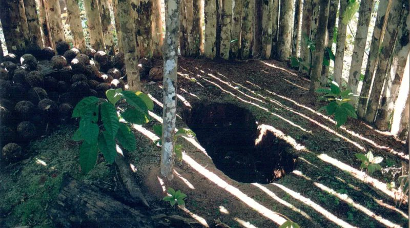
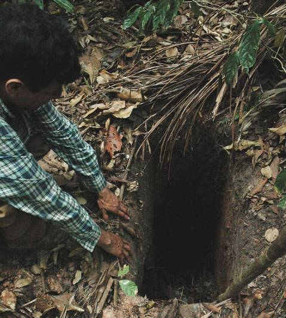
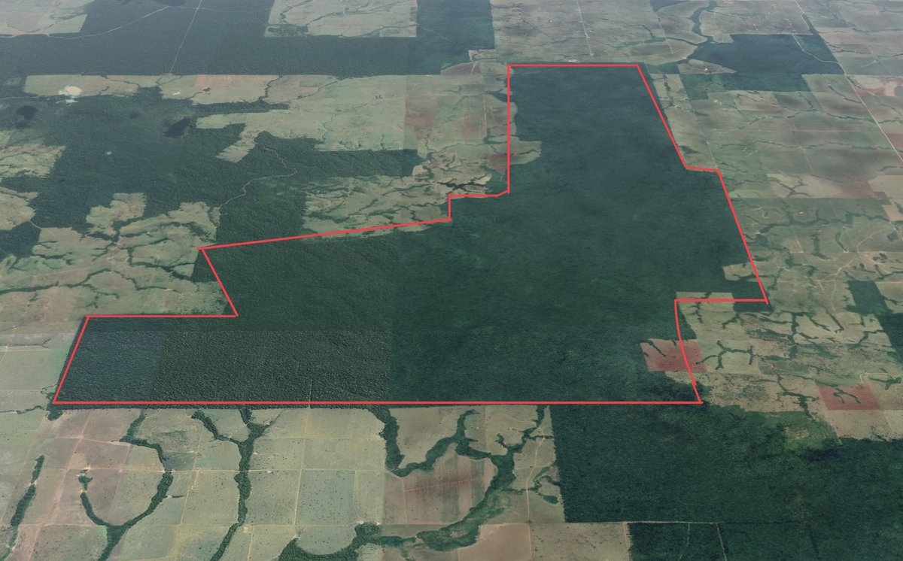
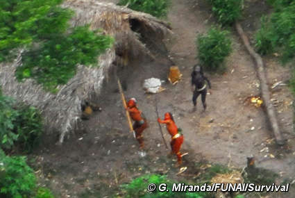

Over the weekend, the loneliest man in the world has been found dead inside his home.

He lived the last 30 years of his life under surveillance in a 80km wide, government enforced, exclusion zone, created specifically around him.

This is the true story of the Man in the Hole.

This is not, of course, a story of some super powered dangerous hermit living in a fancy prison. There are terrible crimes, but he was the victim of.

The Man of the Hole was the last survivor or a tribe whose existence we were only made aware after they were all murdered.

In 1986, after multiple reports of genocide of uncontacted tribes, Santos, a representative of the Brazilian "National Indian Foundation" (FUNAI), went to the state of Rondonia to investigate and found a remains of a demolished village, where all the huts had 3m deep holes inside

<figure>

</figure>

The farmers accused him of creating a fake tribe to prevent the regional development, threatened his life and he eventually was forced to quit. The story would have been forgotten but 10 years later Santos returned as the head of Uncontacted Tribes section, looking for survivors.

This time he brought journalists and found definitive proof of a lost tribe, which finally got front page news.\
Santos kept searching for any survivors and found evidence of a hut with recent occupation, along with tools and some gardens. Someone had survived!

<figure>

</figure>

From 1995 to 2006 Santos organized many expeditions to contact the sole survivor of the lost tribe. During one of these one of the expedition members was shot with arrows. After this they ceased any attempt of contact and created an 80km isolation area around him.

But he was surrounded. Farmers kept destroying all the forest around the exclusion area and threatening to kill the Man in the Hole. In 2009 the local Funai outpost was burned and they found evidence of gunshots on his hut. But he survived.

<figure>

</figure>

The Man, whose own name we never learned, was found dead in his tent this weekend. He was found in his hammock, with a special ceremonial paint, as if he knew his time was near. Exact cause of death is to be determined but it seems to be from natural causes. He was about 50yo.

After the autopsy, his body is to be returned to his land to be buried.

Along with his name, we will never know what he called his tribe, language they spoke, what they believed about death or whatever burial ceremony they had, nor the purpose of the holes.

His is not an isolated incident. During his (our) lifetime the state of Rondonia has transformed from a wild forest into a huge Cattle and Soy farm.

Both the indigenous people and the officials trying to protect them are under a constant threat of life.

<figure class="youtube">
<iframe src="https://www.youtube-nocookie.com/embed/dUlh2_bUo60" title="Google Timelapse: Rondonia, Brazil" loading="lazy" allowfullscreen allow="accelerometer; autoplay; clipboard-write; encrypted-media; gyroscope; picture-in-picture"></iframe>
</figure>

In 2019 Macxiel Santos (no relation), a FUNAI official was murdered in Amazonas, a crime that remain unsolved. Earlier this year another official Bruno Pereira and  British Journalist Dom Phillips were also murdered. Arrests were only made after intense international pressure.

Brazil has over over 67 uncontacted Tribes. These are neither a First Contact or Encino Man stories about some unspoiled people ready to see the wonders of modernity. Often these are single families who are aware and going to great lengths to avoid us.

<figure class="youtube">
<iframe src="https://www.youtube-nocookie.com/embed/1xkTN1Z1rTQ" title="Encino Man Theatrical Trailer" loading="lazy" allowfullscreen allow="accelerometer; autoplay; clipboard-write; encrypted-media; gyroscope; picture-in-picture"></iframe>
</figure>

<figure>

</figure>

To learn more about the isolated people:\
[survivalbrasil.org](https://www.survivalbrasil.org)

A book on the Man in the Hole:\
[amazon.com/Last-Tribe-Epic-Quest-Amazon/dp/1416594744/ref=nodl\_](https://www.amazon.com/Last-Tribe-Epic-Quest-Amazon/dp/1416594744/ref=nodl_?dplnkId=2a314713-09d2-4795-a6db-ba7af70f5880)

Corumbiara, a documentary about the case:

<figure class="youtube">
<iframe src="https://www.youtube-nocookie.com/embed/_j1RXDo2MXw" title="Corumbiara - Trailer" loading="lazy" allowfullscreen allow="accelerometer; autoplay; clipboard-write; encrypted-media; gyroscope; picture-in-picture"></iframe>
</figure>

If you want more random Brazil Trivia, definitely don't follow me.

Most of my tweets are about random ethereum topics but I will occasionally post random bits on Brazil history.

[blog.vandesande.design/random-brazil-trivia](https://blog.vandesande.design/random-brazil-trivia)
