> "We’ve basically got it all worked out, except for small stuff, big stuff, hot stuff, cold stuff, fast stuff, heavy stuff, dark stuff, turbulence, and the concept of time.” - Zach Weinersmith

Physicists often talk about the goal of finding a “Theory of Everything” that would connect all the current areas of knowledges. How does relativity work in the very small scale? How does quantum mechanics behaves in very hot temperatures? Our knowledge of how stars explode seems completely separate from the engineering of buildings, which is a completely separate field of knowledge on how particles decay and form atoms, which seems like a separate science from the origin of time. However nature seldom has clear divisor lines and sometimes, just understanding how things connect can help us understand better the universe we live in. In 2023, Physicists Charles Lineweaver and Vihan Patel made a beautiful step in that direction by publishing [a beautiful paper](https://pubs.aip.org/aapt/ajp/article-abstract/91/10/819/2911822/All-objects-and-some-questions?redirectedFrom=fulltext) which despite it’s captivating content, was densely technical and flew completely under the radar for even the most science leaning public.

<figure>
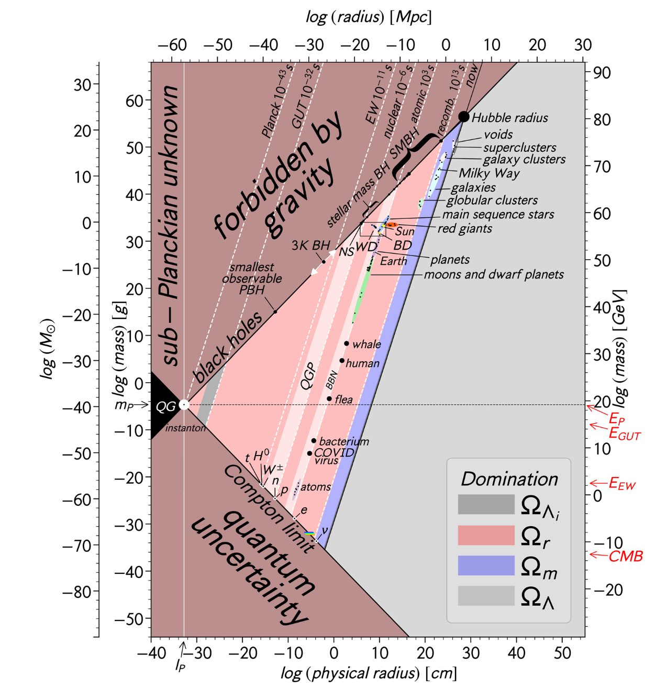
<figcaption>Lineweaver-Patel's log log chart of all objects</figcaption>
</figure>

This post explores redesigns Lineweaver and Patel’s chart and tries to explain each step and expand it. Let’s explore!

<figure>
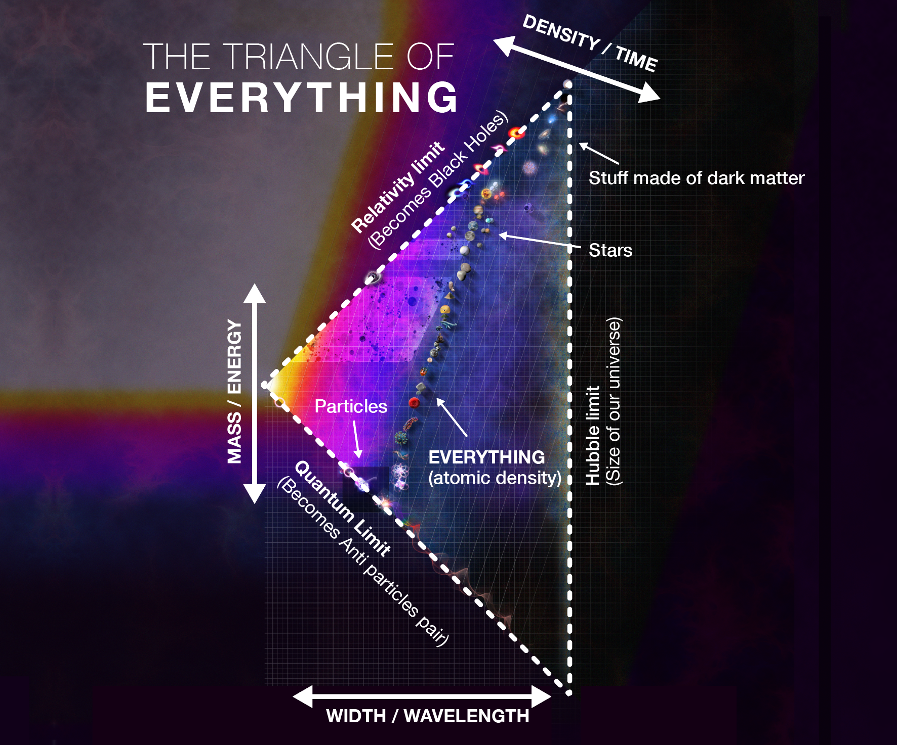
<figcaption>Am attempt to redesign and explain it.</figcaption>
</figure>

Anything that has ever existed can be plotted on a chart, a single image that tells the story of the Big Bang, how space relates to time and energy, a poster-sized document about how quarks become protons, how stars become black holes, how asteroids become planets, and even why hippopotamus can’t float. It’s a whole physics lecture on a single page. Let’s walk through it.

**A summarized poster version of this article can be found at** [**vandesande.design**](https://vandesande.design/products/poster)

<figure>
<!-- The picture that stood here was already gone on Paragraph: only its caption was left. -->
<figcaption>This poster about everything can be found at www.vandesande.design</figcaption>
</figure>

### The Powers of 100 {#h-the-powers-of-100}

The first problem of trying to fit all particles and objects in a single chart is one of scale. The sun, for example, is over 400x wider than the moon, so in any image that the sun appears whole, the moon will be but a pixel. The largest human structures ever built, would also be barely visible when compared to the moon, but absolutely dwarf a human. In [animation](https://www.youtube.com/watch?v=i93Z7zljQ7I) and [video](https://www.youtube.com/watch?v=0fKBhvDjuy0) this is often addressed by having a continuous zoom to show relative sizes, but on a static media this is best addressed switching to a logarithmic scale.

<figure>
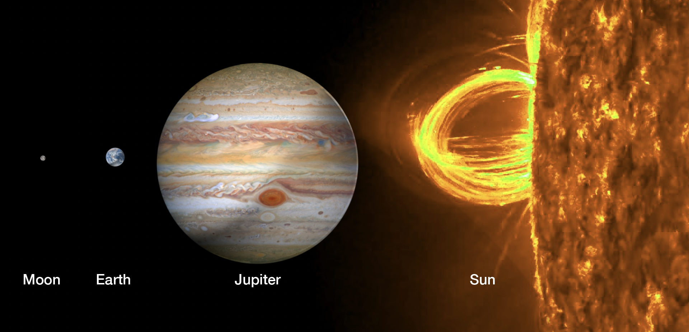
<figcaption>A single solar filament, which extends from its surface into space, are many times larger than our planet.</figcaption>
</figure>

$$e$$

<figure>
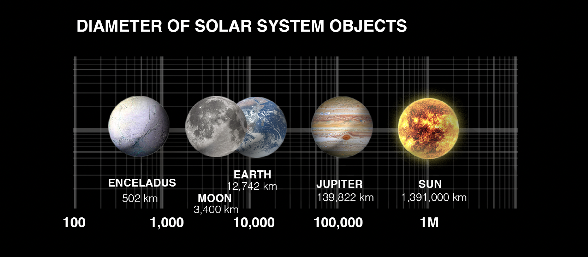
<figcaption>Earth's radius is almost precisely Tau (𝝉 = 2𝜋 = 6.283..). This is because the Meter was originally defined based on the circumference of the earth, but the calculation done in the late 1700's was off by only 1.5%.</figcaption>
</figure>

$$10^{-35} m$$

We can then repeat the same for the vertical axis, but now for mass. This essentially becomes what is known as a scatter plot representing the relationship between mass and width of all objects. Below we have a graph representing objects from a red blood cell to the largest mammals and large human mande structures like a Soccer Stadium or the Las Vegas Sphere.

<figure>
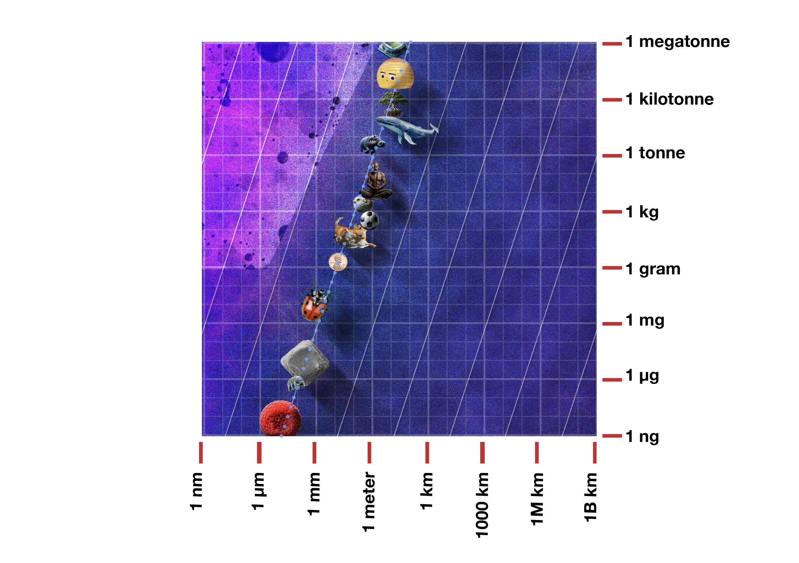
<figcaption>Hypopotamus cannot actually float, instead they skip around the bottom of rivers</figcaption>
</figure>

The first thing we’ll notice is that almost everything is in the same a diagonal line, with an angle of about 3 to 1. Every 10x increase in width an object will increase 1000x in volume, so objects that are aligned in these diagonals have the same density. And even though objects have different densities, in a log chart these do not reflect much change. The blue dotted line represents the density of water, meaning anything to the right of the dotted blue line will sink into water.

Osmium, earth’s densest natural material, is only 20x denser than water. Helium gas, on the other hand, is about 20x less dense than water. This is why most known objects will fall on roughly on the same line, and this will extend all the way into our sun!

<figure>
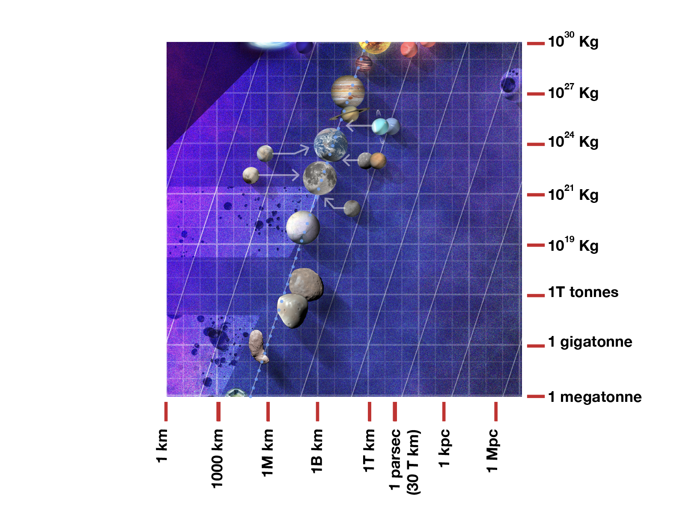
<figcaption>Yes, Saturn could float on water, it's as dense as styrofoam.</figcaption>
</figure>

The smallest object on the above graph is the Itokawa asteroid, which was visited by a Hayabusa space probe and successfully returned to Earth, the first probe ever to accomplish that. Then we have the two moons of mars, Phobos and Deimos and Enceladus a small moon of Saturn, believed to harbor a liquid ocean under its frozen crust. Something interesting happens between those last two however, as objects move from 1 trillion tons of mass they start becoming rounder until they are near perfect spheres. This is because the force of gravity overcomes any molecular bonds that keep objects rigid, and at this scale can be basically considered fluid and acquiring a spherical shape. It’s the first requirement to be classified as a planet, like Pluto (albeit a dwarf one).

Small planets and moons don’t have the gravity to hold very light elements like hydrogen and oxygen, so there’s no atmosphere. Larger planets like Earth, Mars, and Venus do, but they exist in a Goldilocks zone: too big, and they hold so much hydrogen that the planet doesn’t have a surface anymore and becomes a gas giant. Gas giants have a solid core, but there’s no set boundary between their low-pressure surface and their dense core.

###  {#heading}

<figure>

<figcaption>Yes, Saturn could float on water, it's as dense as styrofoam.</figcaption>
</figure>

### Stars and Planets {#h-stars-and-planets}

So far all objects on the graph are just following the same boring line: but that starts to change when we reach stars. Electromagnetic forces are what keeps atoms away from each other and the main reason our density line becomes constant. But as mass increases, the force of gravity starts to increase too and at some point, when an object surpasses roughly 50% more massive than Jupiter, gravity overcomes Electromagnetic repulsion and the object starts becoming smaller the more massive it is (this process is called Degenerate Matter). Its center is so dense that fusion starts happening, first with Deuterium (heavy hydrogen) and the object starts emitting energy, becoming a Brown Dwarf—a middle ground between a Gas Giant and a Star.

But once the mass reaches a critical point, where the pressure of the atoms overcomes the repulsion, regular hydrogen starts fusing into helium and other elements, releasing a huge amount of energy in the form of electromagnetic radiation (including light) and that energy starts pushing the atoms apart again. We are now in Star territory.

And while the new energy from the fusion of atoms seems to allow stars to keep the same density line, that process is not as stable as the repulsion from electromagnetic forces. If the fuel exhausts too quickly the object will collapse into a White Dwarf. Even more massive

That object now becomes a star. The future lifespan of a star also depends on its mass: a small star, once it exhausts its fuel, will transform into a White Dwarf, which will exist for trillions of years. More massive stars will enter a Red Giant phase (some as Blue Giants or Super Giants), during which their outer layers expand, engulfing any planets in their orbit. Once the fuel of a Red Giant is exhausted, the star will go supernova and shed its outer layers across vast distances. Depending on what remains, it will leave behind a White Dwarf, a Neutron Star, or a Black Hole. Stars have a size limit; beyond 100 solar masses, they don’t have enough energy to sustain their size and will immediately collapse into black holes.

<figure>
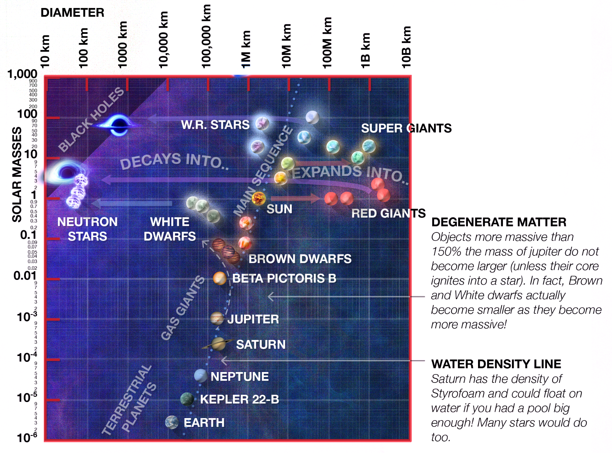
</figure>

### First boundary of the triangle: black holes {#h-first-boundary-of-the-triangle-black-holes}

And thus, we reach the first density limit of our universe: the Schwarzschild radius. Once an object exceeds a certain critical density, it will collapse into a black hole. While all the mass in a black hole is considered to be in a single-point singularity at the center, there is a practical radius outside which light cannot escape. This diameter is directly dependent on the mass, which is why the Black Hole line has a lower angle than the isodensity lines we were following before.

But after we crossed the scale of stars, something else interesting happens: as we look at objects on the scale of galaxies and globular clusters, they also fall into a separate diagonal line, also proportional to volume. However, this isn’t the density of atoms as we know it, but the density of dark matter structures. This indicates one of the reasons Dark Matter is so hard for us to understand: its density is less than that of a typical lab vacuum, and can only be observed in very large objects. Yet, it constitutes most of the stuff in the universe. It is possible that there are smaller objects made of Dark Matter, like Dark Planets and so on, but because they’re so sparse, they're hard to detect by the standard methods used to find exoplanets.

The largest structures we _can_ observe in the universe are Superclusters, like the Laniakea Supercluster, in which the Milky Way is located. We can also see large Voids where almost no galaxies can be seen: but they still have roughly the same density as the rest. Finally, we reach the upper limit in size and mass: our own observable universe.

<figure>
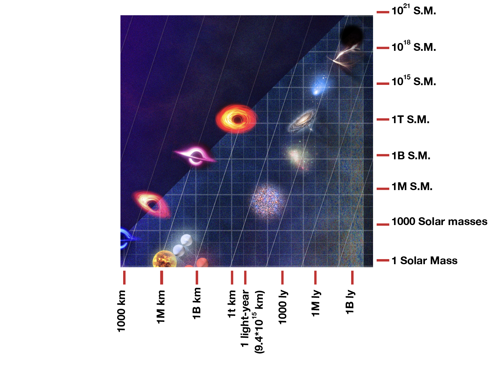
</figure>

### Second boundary: the Hubble Radius {#h-second-boundary-the-hubble-radius}

Due to the constant expansion of the universe, there are some regions that are moving away from us faster than the speed of light, meaning that not only can light from them not reach us, but nothing else can either. It implies that there’s no way anything happening there can ever affect us or even be known by us. This is why, despite our universe being truly infinite in size, in practice physicists often use the terms “observable universe” and “our universe” interchangeably. The universe is infinite, but OUR universe is the size of the Hubble sphere.

This brings us to the second side of our Triangle of physical bounds: the Hubble radius. No structure in the universe (the whole, infinite universe) can be larger than a Hubble length, because if it were, one side would not be able to communicate with or affect the other in any way, and therefore it can’t be considered a single entity. The observable Universe, “our” observable universe, is not one, but an infinite number of bubbles, as every star and every point anywhere will have its own Hubble Sphere around it, limiting what it can observe, much like the Earth’s horizon is an individual circle around each observer.

But what about the other end?

<figure>
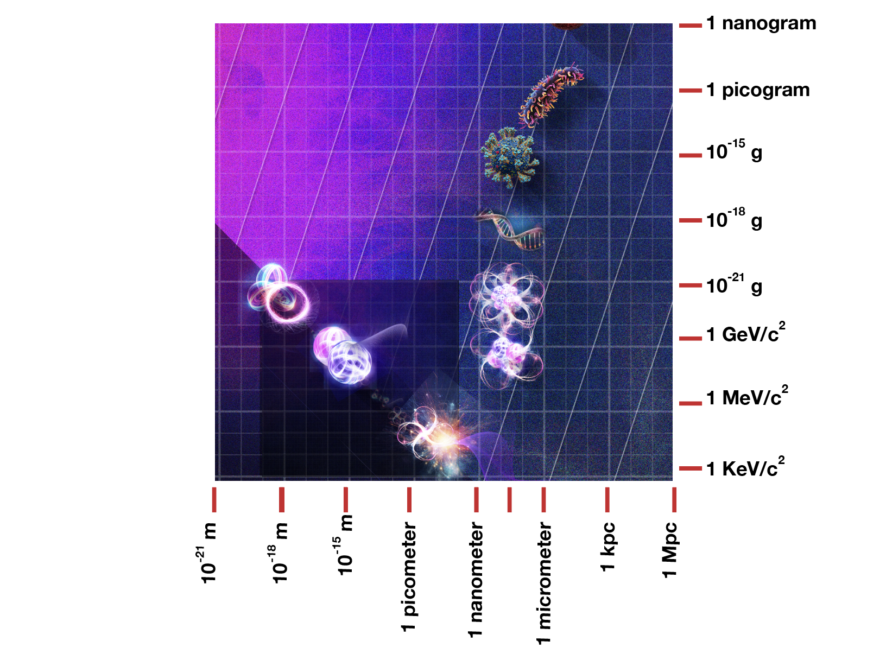
</figure>

### Third boundary: the Compton Limit {#h-third-boundary-the-compton-limit}

On the other end, we see objects following the same density line: from blood cells, to microbes, to viruses, to molecules, and individual atoms, all seem to follow roughly the same density as the atoms of which they are made. This is also where we move from biology into chemistry and then into particle physics.

Something interesting happens in the bottom left corner: the darker line represents the Compton Limit. Like the Schwarzschild radius, it’s also directly proportional to mass and not volume, and therefore, in our graph, it appears as a line at a 45º angle to the grid. It represents the size at which Quantum Uncertainty meets the energy level of the particles such that anything with sufficient mass, or small enough size, may spontaneously become a particle-antiparticle pair and annihilate itself. Most of our known particles are in a smaller region at the bottom. Let’s zoom in.

<figure>
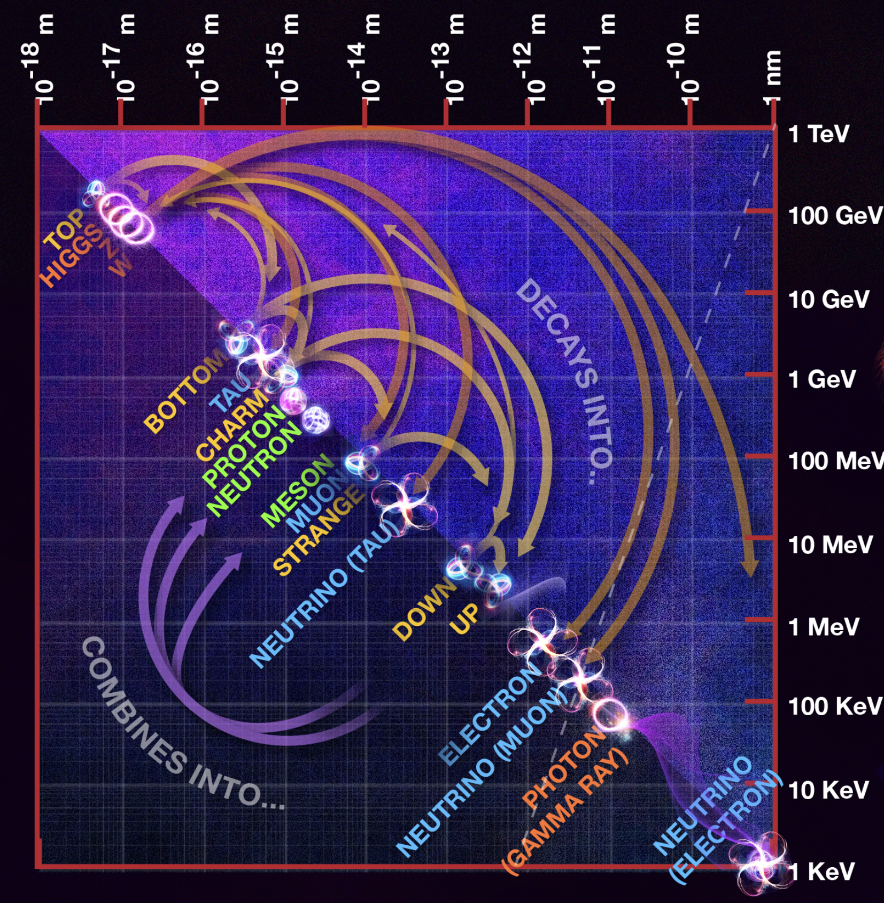
</figure>

All known particles reside somewhere on the Compton Line. For particles that don’t have mass, we plot them using their mass-energy equivalent from Einstein’s equation (more on that later).

Particles have a complex network of transformations and decays, also dependent on mass. The Top Quark decays into a Bottom Quark, which then decays into even lighter quarks, each time emitting a W Boson in the process. The W Boson, in turn, decays, emitting a Lepton (an Electron, Muon, or Tau) and their corresponding anti-neutrino (or vice versa). Up and Down Quarks combine to form Protons, Neutrons (and sometimes another Meson), implying that the W Boson itself is instrumental in the origin of most known fundamental particles.

<figure>
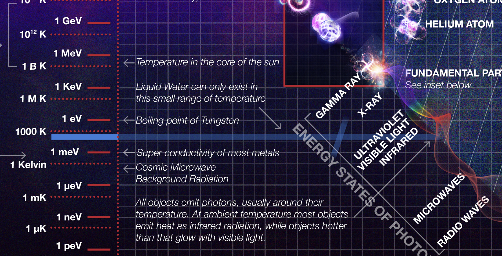
</figure>

### Mass is energy which is temperature {#h-mass-is-energy-which-is-temperature}

As mentioned, that graph is also plotting some massless particles like photons by using the E = mc² equivalence, so our vertical mass axis is also an energy axis. As photons become more energetic, their wavelength decreases, so our horizontal axis for spherical diameters also doubles as the wavelength measure for the Electromagnetic spectrum. You’ll notice that the point at which our atomic density line crosses the Compton line is around the Gamma Ray region, which is the radiation emitted during nuclear reactions, like fissioning an atom. It then goes down into X-rays, ultraviolet, our visible spectrum, and ends in long radio waves.

Energy is also equivalent to temperature through the Boltzmann constant. This means that now our Mass-Energy vertical axis is also a temperature one. Since this is a logarithmic scale, the range from 0° to 100°C, in which water can be liquid and all known life exists, is displayed only as a thin blue line. It also crosses the EM spectrum at the Infrared range: what does this mean? All matter emits radiation in a spectrum similar to the temperature it occupies. This is why all objects at room temperature emit Infrared radiation as heat, and as they start getting a little hotter, they begin emitting visible light. The Sun, which is at much higher temperatures, also emits Ultraviolet, and to a lesser extent (especially in solar flares), X-ray and Gamma rays from its corona.

What about even hotter temperatures? The core of the Sun is even hotter and has enough pressure to fuse hydrogen into helium, reaching 15 million °C or 15MK (at very large numbers, the Kelvin and Celsius scales are nearly identical). Some more extreme astronomical events like giant stars, supernovas, or black holes can reach up to 1 billion K. But to find even hotter temperatures, you'll need to come back to Earth, or more specifically to Switzerland, where the Large Hadron Collider can reach up to 100 TeV of energy, equivalent to over a quintillion degrees Kelvin. At these energy levels, protons and neutrons (the “hadrons” being collided) will “melt” into their constituent quarks, and the less energetic quarks will transform into more energetic equivalents. At the highest temperatures the LHC can reach, it was even able to briefly create the Higgs Boson, which imparts mass to other particles. Such temperature levels were last seen in the universe only a few picoseconds after the Big Bang (unless some other alien scientists have beaten us to it!).

And this takes us to our final leg in this journey across the universe: the axis of time since the Big Bang.

### Another axis: density and time {#h-another-axis-density-and-time}

The Big Bang is often visualized as an explosion of something expanding into nothingness, but that’s far from the truth. As far as we can measure (and we’ve done it to an incredible acuracy!), the universe is infinite: how can something infinite still expand? Expand into what? It’s better to visualize it instead as a continuous decrease in density and temperature. The universe started as extremely hot and unbelievably dense and has become less dense and cooler over time. While this progression is not linear, it has always only moved in one direction. Like any gas, as you increase the density and pressure, you increase the temperature. In the case of our universe, increasing the temperature (or more precisely, the “energy levels”) of particles works like turning back the clock to see how the whole universe was in the early moments. We have conducted practical experiments to recreate the conditions of the universe only a few picoseconds after the Big Bang, and our theoretical models can go even further, down to the Planck Scale.

Wait, the Planck what?

<figure>
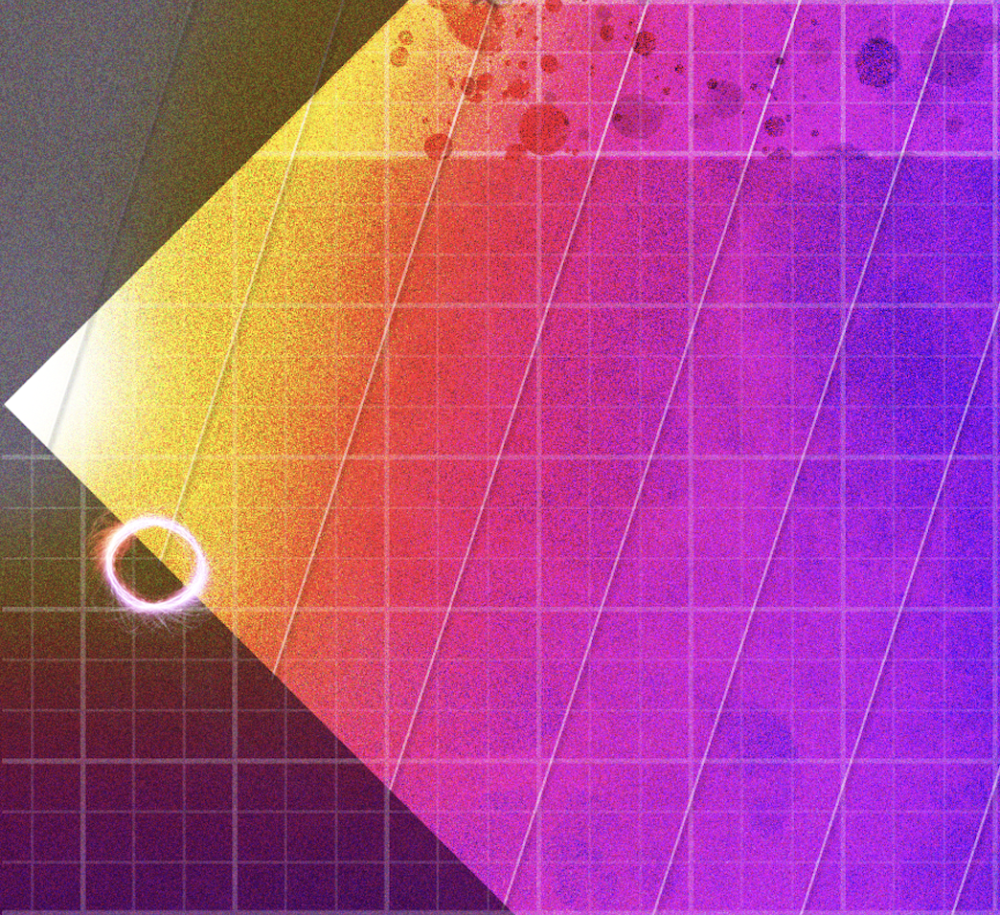
</figure>

### Planck Units: a truly “universal” system of measurements {#h-planck-units-a-truly-universal-system-of-measurements}

In most forms of measurement, units are defined based on something related to human experience (the King’s foot, the meridian of Earth, the boiling temperature of water), and then the universe’s fundamental constants are calculated based on that and added to equations. Planck Units reverse this logic and instead define both the Speed of Light and the Gravitational Constant as one, and the Planck constant to be equal to the circle constant. In short:

 $$G = e = 1$$

This greatly simplifies many physics equations:

 $$E = mc²$$$$r_s = \frac{2Gm}{c^2}$$

The Planck units also have physical manifestations and converge at the Big Bang itself, as all of them represent some type of either limit of our model or a transition between them.

The Planck Length represents a limit where the effects of relativity over spacetime and quantum uncertainty about location converge, and making sense of that would require a new theory of quantum gravity. Similarly, our current models cannot comprehend anything that happened before one Planck Time (the time it takes light to travel a Planck Length) after the Big Bang, nor anything at temperatures higher than Planck Energy (which is the energy level the universe was at a Planck Time). All known fundamental particles simply cannot exist as we know them at such temperatures and therefore did not exist at the time. To even address it would require a theory of everything, that would unify all forces, including gravity.

<figure>

</figure>

### Everything is just condensation {#h-everything-is-just-condensation}

The history of the universe can be thought of as fundamental particles condensing out of the background, similar to how droplets of water condense out of water vapor as it cools, thereby creating new conditions for new composite objects to emerge. Droplets of rain will condense into rain, which collects into oceans that then become the solvent for countless chemical reactions and the required medium for life as we know it. Similarly, Bosons serve as the mediators of fundamental forces and, as the background energy of the universe cools, they emerge out of the primordial soup in different flavors, breaking down the fundamental forces that existed before into new ones.

 $$10^{-32}$$

As the universe further cooled down and expanded, up and down quarks, joined by Gluons, formed Protons and Neutrons, and then, as molecular bond forces overcame the background energy, they became atoms (the universe was barely a few minutes old and had the density of water). Further cooling meant that the kinetic energy of atoms was low enough to be overcome by chemical bonds, allowing atoms to form into molecules, and then for these atoms to condense into stars and planets (this took about three to four hundred thousand years).

During those multiple phases, the universe had different densities and was dominated by different forces (like radiation, matter, or dark energy). In our chart, we can imagine the universe's expansion as a diagonal line going from the left to the right, leaving composite objects in its path. The current density of the universe is roughly the same as that of objects we know to be mostly made of Dark Matter, like galaxies, clusters, and voids.

<figure>
<!-- The picture that stood here was already gone on Paragraph: only its caption was left. -->
<figcaption>The "constrains" for Macro Dark Matter: smaller than an asteroid, maybe a moon, bigger than a coin, very dense.</figcaption>
</figure>

### **Searching for Dark Matter** {#h-searching-for-dark-matter}

We know most of the universe is made of it, yet we don’t know what it is. However, we have been searching for it long enough to know a lot about what it is not.

It’s possible that it's not some new particle requiring new physics, but rather just something made of the particles we already know of, like Hadrons, Quarks, and Leptons. We’ve searched for it using Gravitational Lensing with both [earth-based observatories](https://en.wikipedia.org/wiki/Optical_Gravitational_Lensing_Experiment) and [space-based ones](https://en.wikipedia.org/wiki/Fermi_Gamma-ray_Space_Telescope). If Dark Matter were just made of hard-to-detect stars or lots of rogue planets, we’d have seen it by now.

We also looked for dark matter in the mineral layer of the Earth, knowing that if it was smaller than a few grams, it would have left a mark there. We didn’t find any there either. There’s also a separate line, proportional to the surface of the cross-section and its mass, that would have left some holes in the Cosmic Microwave Background. We looked, and it wasn’t there either.

Meaning that if Dark Matter is made of large objects of stuff we already know, then there’s a specific region where it would be found. One such candidate would be Primordial Black Holes. These are Black Holes formed not from the collapse of stars but from remnants of small fluctuations in the fundamental plasma in the very early moments of the Big Bang. If they exist, they would have masses between a small moon and an asteroid, with a Schwarzschild diameter between micro and picometers (the size of a proton). Larger than this and we’d have seen them in our Microlensing experiments, and smaller than that, and they would have already faded away due to Hawking Radiation.

<figure>
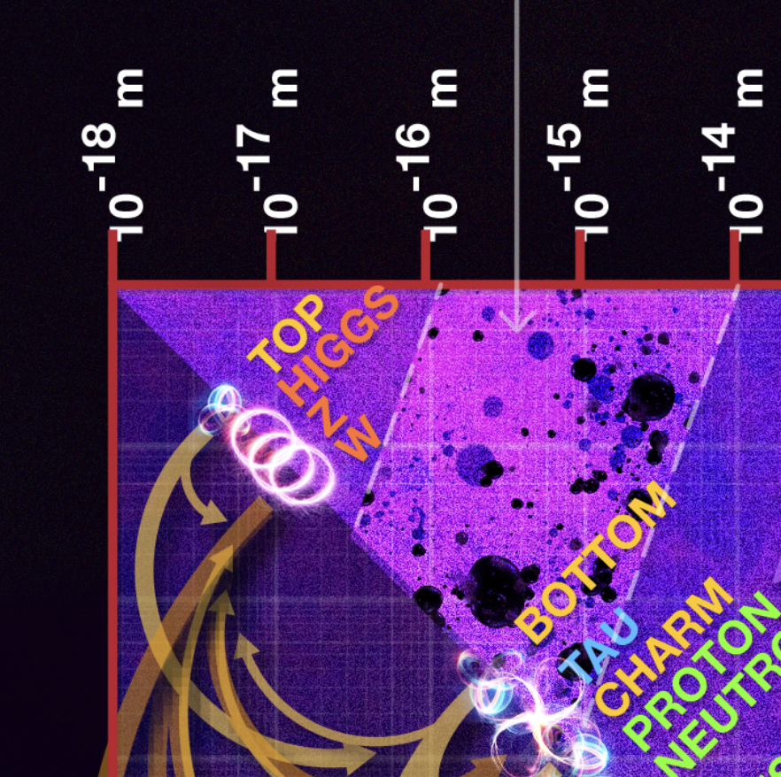
</figure>

Or, of course, Dark Matter could also be a new fundamental particle requiring some new physics. If that’s the case, then we also know where it should be: mostly because physicists have been running experiments looking for it – and failing to find it – for many decades. If Dark Matter is some sort of WIMP (Weakly Interacting Massive Particle), then it should be found somewhere between 1 and 50 GeV.

In science, failing to find new data is still new data. In the 19th century, scientists spent decades looking for an entity they called the Aether, which would be the medium for light, by trying and failing to measure the difference in the speed of light in the direction the Earth was moving. All those experiments always led to a result of zero, with increasingly more decimal places.

This inspired Einstein to think about what it would mean if the speed of light was indeed always constant, regardless of the direction of travel, and the result was the Theory of Relativity, which redefined Classical Physics (back then just called “Physics”) for very high speeds. Maybe this is what’s happening, and we just need to adjust our Gravity equations for very large objects? However, this possibility has become increasingly unlikely as we have found galaxies where the center of mass is not the same as the center of mass of the visible stars, suggesting it’s not just a miscalculation of gravity but rather something separate from regular baryonic (non-dark) matter.

<figure>
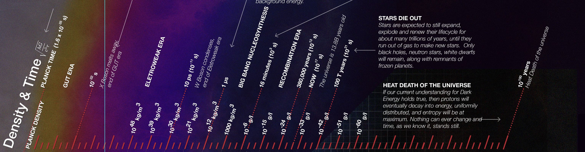
</figure>

### The Far Future {#h-the-far-future}

 $$10^{-30} g/L$$$$10^{100}$$

### The end {#h-the-end}

On that note, we end our journey. What started as a simple density plot became a story of the universe’s past, present, and future, a map of the things we know, an indication of what we know we don’t know, and maybe where to find those we don’t even know we don’t know.

**A print version of the main poster can be found at** [**vandesande.design**](https://vandesande.design/products/poster)

_References:_

- [All objects and some questions](https://pubs.aip.org/aapt/ajp/article-abstract/91/10/819/2911822/All-objects-and-some-questions?redirectedFrom=fulltext), by Charles H. Lineweaver and Vihan M. Patel (Am. J. Phys. 91, 819-825 2023))
- [Macro Dark Matter](https://arxiv.org/abs/1410.2236), by David M. Jacobs, Glenn D. Starkman, Bryan W. Lynn (arXiv:1410.2236)
- [Dark Exoplanets](https://arxiv.org/abs/2303.12129), by Yang Bai, Sida Lu, Nicholas Orlofsky (Phys.Rev.D 108 (2023) 10, 103026)
- _Credits for illustrations used: NASA, ESA, Hubble and artists from Wikimedia Community: Ivanov, Pablo Carlos Budassi, SounderBruce._
