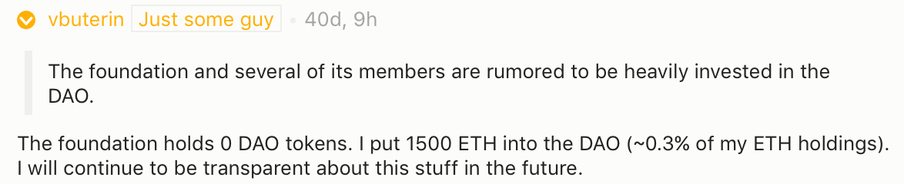
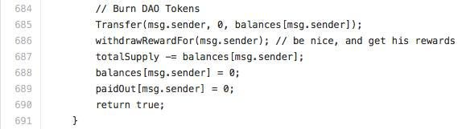
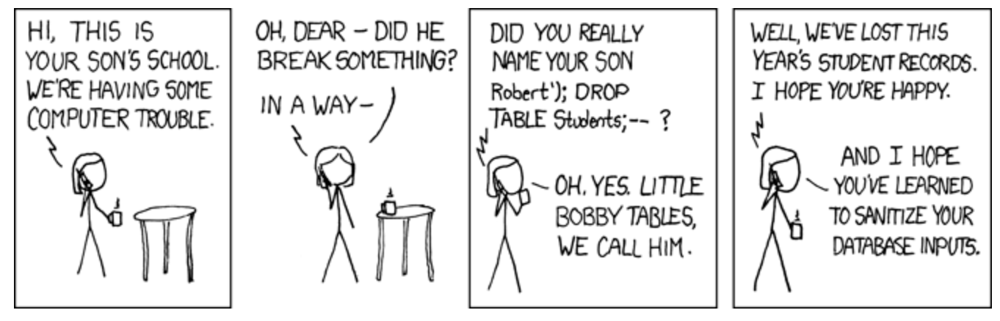
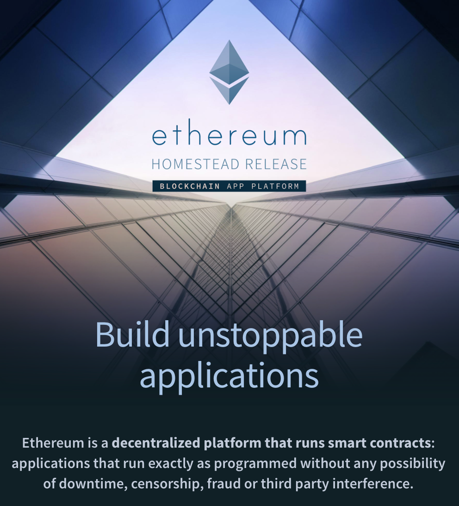
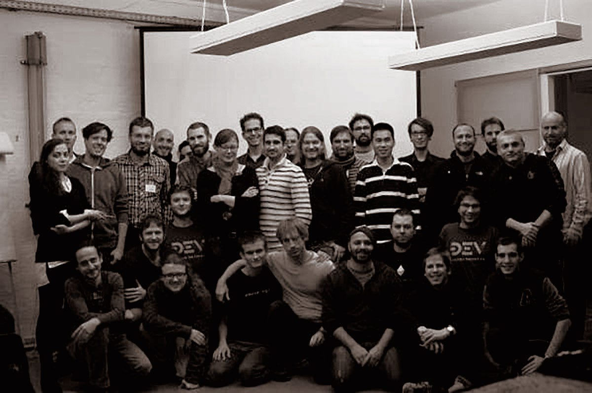

**I respect Ethereum’s Classic philosophical position**, in fact I was [among the first](https://twitter.com/avsa/status/743777328082358272) to be publically against the hard fork, and helped in all other ways to avoid it. Once I felt there was an overwhelming majority support for it (and after having helped build tools to try to measure these supports), and long debates to try to understand both arguments, I accepted — and still do, the majority decision as a good one. In fact, if the fork was merely a dogmatic schism I would be able to appreciate the beauty of the free market figuring out on two philosophical and political positions and no further words were needed. Except, that I care deeply about the truth.

There is a common narrative in some communities that support Ethereum Classic, one in which the Ethereum Foundation is painted as the corrupt bad guys who pushed the fork for financial reasons and the DAO attacker was a liberating hero. A narrative in which the DAO was sloppy code which was obvious to anyone watching that it would crash and burn. A story in which everyone involved was incompetent or unwilling to help.

Those narratives are not only false, but they are are provably, publicly false, yet they persist either because they are easy stories to repeat, or because some of those repeating it are ill-informed or ill-intentioned.

### False claim #1: The EF or their members were financially motivated to fork

<figure>

</figure>

Many foundation developers ([including me](https://www.reddit.com/r/ethereum/comments/4qiqq8/ethereum_protocol_developer_holds_114877_worth_of/d4tvn6m?context=7)) have come forward about their dao holdings. Most (including our Executive director, Ming Chan) have none, some have very small amounts. Many have openly criticized the DAO. Of course, one can argue that we could be lying, or that the big holders are not disclosing but in all internal and private discussions I’ve had within the team, “saving my holdings” was never even brought up. Maybe there’s some shadow figure lurking behind the developers and influencing the foundation’s decision, but they are certainly not among any of the coders I talked to.

Even among those who owned part of the DAO, they had very small amounts, relative to their Ether holdings. **Who would, in their right mind, want to risk 99% of your wealth to save 1%?**

From my experience, I’ve seen the opposite happening. When the news that a white hacker group needed DAO tokens to try to salvage the remainder of the DAO, most volunteered to donate their own tokens, without knowing if they would be burned in the untested process or even asking the identities of the hackers, just to try to save the DAO.

### False claim #2: The Fork came from the foundation against the community wishes

The first client to start working on the Fork was Parity, developed by Ethcore and not affiliated with the EF. The Foundation develops two clients, the C++ (which only started working on a compatible version after the fork) and Geth, which started implementing the Fork late in the game. If anything the go developer team was heavily criticized for taking too long to build and test their code.

It’s true that Vitalik was one of the first to propose a fork, right after the DAO hack, but it was seen as one of many options and not a yet definitive answer. Anyone who participated on any ethereum community during the long 30 days that preceded the fork can attest that this was a highly debated topic. I personally helped built [Stake Voice](https://github.com/ethereum/stake-voice) as a Mist App to help measure how much the community actually felt about it. It was based on some code from [Ether Signal](https://github.com/vulcanize/ethersignal) a forum weighted by ether stake that was being built for the occasion. [Carbonvote](http://carbonvote.com) was created by the Chinese ethereum community and was released a couple days before any of those tools became available and soon became the most popular polling app. While Geth had a default, [Mist, and the Ethereum Wallet](https://github.com/ethereum/mist/releases/tag/0.8.1), the official GUI clients did not choose any and forced users to pick from a randomized window.

Carbonvote was not the sole measure, talking to individuals, companies, outside developers, reddit up votes, twitter polls, any signal we could measure indicated the Fork had a high community support. And it showed on the day of the Fork. We immediately had over 90% of the hashrate and market. **The community had a near consensus for this option and the anti-fork group was a minority.**

The foundation provided the community a choice they were loudly and repeatedly asking us for.

### False claim #3: The DAO issue were entirely the DAO’s creators fault

At launch day, The DAO was lauded as an overwhelming sucess, having being reviewed by the foremost experts in the field, the crowd, and a private security audit. At the day of the hack, it was immediately derided as sloppy coding, hastily built and unreviewed. Notice the difference?

<figure>

</figure>

The DAO hack was made possible due to two lines of code in the DAO, where first it sent funds and _then_ it changed the owed balance. It’s true that had these lines being in a different order the hack would not be possible.

But while the first reentrancy behavior was described on an [unnoticed blog post in 2014](https://forum.ethereum.org/discussion/1317/reentrant-contracts), it was not widely understood until it was rediscovered by the [developers of MakerDAO](https://www.reddit.com/r/ethereum/comments/4nmohu/from_the_maker_dao_slack_today_we_discovered_a/) with a similar hack that allowed them to drain their own contract. So the importance of that particular ordering of the code was not known by any of the experts in the field. The hack would not be possible if Solidity, the official language treated nesting differently, or how much gas it would send in the _.call()_ function. The bug would have been discovered if formal verification tools where available, that would allow to mathematically assert some invariants (like that no one could get more than it had).

I’ve seen the bug being compared to [SQL injection](https://xkcd.com/327/), an unexpected behavior that at some point affected most web applications, but once it came to the public consciousness of web developers, it was rather trivial to prevent.

<figure>

</figure>

So while demise of the largest crowdsale in history was caused by two lines of code on a contract, it was also caused by a series of immature tools in an 8 month old ecosystem, dealing with completely new fields of knowledge.

**The biggest mistake in the DAO wasn’t bad code but launching when the platform was still too young and the tools still immature.** [In hidsight](http://southpark.cc.com/clips/360430/captain-hindsight) it’s easy to point that many things could have been done to limit the size or scope of the project, but the truth is that nobody expected the DAO to become as big as fast as it became. **The DAO was Ethereum’s first viral sensation.**

### False claim #4: Nothing else was done to prevent the issues

This criticism usually comes in two flavours: that either the curators / developers / slockit didn’t do anything when warned or that they did too much and should never have interfered. As a curator, an ethereum developer and a friend of many involved, I was witness to many of those key moments and can safely say this was not true at all.

The [first issues of the DAO](http://hackingdistributed.com/2016/05/27/dao-call-for-moratorium/) were raised by Emir Gün and Vlad Zamfir. The curators responded by following the suggestion of a moratorium and no proposal was approved. After the reentrancy attack was reproduced on MakerDAO, it was soon pointed out that it could be used to attack the DAO reward account (which was empty), leading the Slock.it team to publish the now infamous “[No Funds at risk](https://blog.slock.it/no-dao-funds-at-risk-following-the-ethereum-smart-contract-recursive-call-bug-discovery-29f482d348b#.fwogvbkt3)” blog post. Very few people at the time understood the full extent of the bug and therefore no one realized it could be used on the split function until the attack happened. It’s also important to note that **even if someone had disclosed it responsibly it’s probable that there would be no way to salvage the DAO.** It was already live and holding the funds when the first reentrancy issue was found and the Curators had no power to stop it (curiously, curators where criticised at the time of “having too much power”). Draining the DAO would reveal the issue and trying to upgrade it would take two weeks minimum.

The guys that are often the most vilified on this story are those who lost nights and worked for months without pay to try to salvage the community funds and they are often villified by those who are not taking risks or trying to do anything that has not been done before. In the space of about a month, thousands of new tools were developed to try to salvage what could, white hat attacks, soft forks, blockchain analysis. The Hard Fork was a last ditch effort and everyone tried to keep it as simple as possible because of the small amount of time available (therefore we chose not to deal with replay issues at that moment).

### The No-Fork is not the only logically consistent position possible

All the points I raised before were not opinions but simple true facts, to disprove the false narrative that is used to criticize our decisions. **You can still take the new narrative and disagree with our decision**, but before you do, I’d like to point _where_ the disagreement comes from, as it can surprise you.

<figure>

<figcaption>ethereum.org homepage</figcaption>
</figure>

I’ve received a lot of criticism for the first phrase on the Ethereum.org home page as the fork would change the **“exactly as programmed”** promise. **I wrote that phrase and still stand by it as I still believe that is the vision.** I do not like semantic arguments, and believe the place to argue the definition of words like “bug”, “attacker”, “theft” or “hacker” is on [wiktionary](https://en.wiktionary.org/wiki/hacker).

At the end of the day, what good is to be able to build a contract that will work “exactly as promised” if what it actually does is not what anyone expected? What’s the value of a technology that is intended to build “smart contracts” if not even the top experts in the field can make sure they are either smart or contracts? The DAO was the biggest project that Ethereum ever had, it introduced to thousands of newcomers the very idea of software that manages resources autonomously – and it failed. Of course the Ethereum Foundation _needed_ to be involved, a bug of such size isn’t measured by the amount of money that was stolen, but on how could it affect the public perception of the whole ecosystem.

If you are inventing technology to build giant ships and the Titanic happens, won’t you be involved? If you are in the business of building new jet engines, shouldn’t you help investigate every new crash that could undermine the public’s trust in the whole airplane industry?

Of course, _you can take_ the individualist position where, if you are not directly responsible then you should not get involved in other people’s business. _You_ didn’t build that plane, _you_ didn’t decide to cross the atlantic during iceberg season —why should you care? But it’s not the position I believe in.

It’s not that I don’t care about Blockchain immutability. In fact the Fork taught us two very valuable lessons:

- If there is even a small minority support, Blockchains can resist change and thrive, even if 99% of the miners, users and even the developers want to abandon it
- If there’s a large enough social agreement, a new social consensus can emerge and have more value than the original chain.

Unlike Bitcoin, ethereum was not created by a mythical creature that bestowed us with the magical Blockchain and disappeared into history. I believe not in One Immutable Blockchain, but in blockchains, a technology that can help us fight government corruption, manage public goods via software, reduce waste and increase transparency on markets. Ethereum was created by a group of flesh and bone developers that at some point in history could all fit in one small office in Berlin. You might feel that’s our weakness, that we are too centralised, too cabalistic, but I believe that’s our main strength, that we care and help each other, that we are willing to take unorthodox measures, do things that no one has dared to do, even if it sometimes goes against an unwritten religious tenet on what a blockchain should be, because we have a different vision on what it could be.

<figure>

<figcaption>Ethereum Developers at Devcon 0, 2014</figcaption>
</figure>
