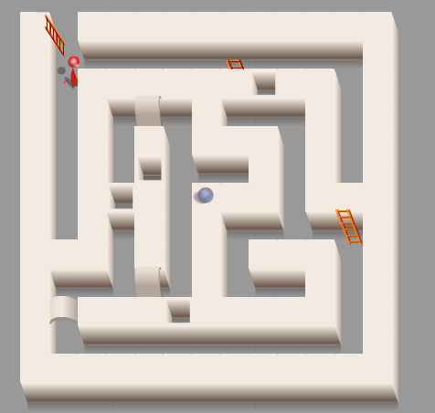
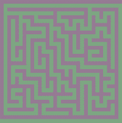
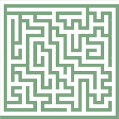
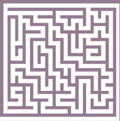
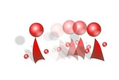

<figure>

</figure>

[Enter the maze](http://wanderingabout.com/mazes/labirinto.html)

Game design and programming. While figuring out an algorithm for building a maze with only one right path, it became clear that in such a maze the walls would be a labyrinth of it’s own. Then it was a natural evolution transforming it into a maze whith special stairs and bridges so you could walk over walls or on the ground.

<figure>

</figure>

<figure>

</figure>

<figure>

</figure>

For centuries labyrinths have been used for meditation. Taking the longest route to go through a short distance, priests would use that time to pray and think. Back then, no one had invented traffic jam.

I also used my long hours in traffic jams to read and think. So I found some funny things about them. The first is that in a true maze (a labyrinth with multiple ways) every point is reached through one and only one way. Another, is that to build one like that all you need is to start with a open circle and draw lines starting from another line and ending anywhere as long as it does not cross or touch any other. And finally I’ve realized that in a maze built like that, not only the space between, but the walls also form a true maze. Beyond programming the algorithm, I drew the character animation.

<figure>

</figure>

- about: Made in 2002. Animation, programming, and algorithm in Adobe Flash and Actionscript.
