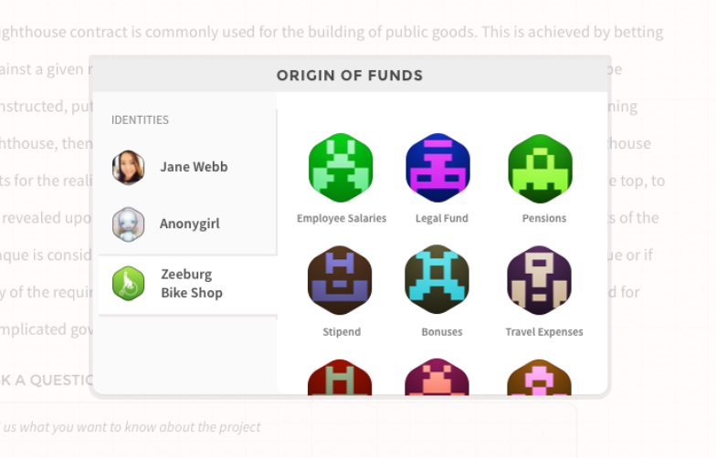
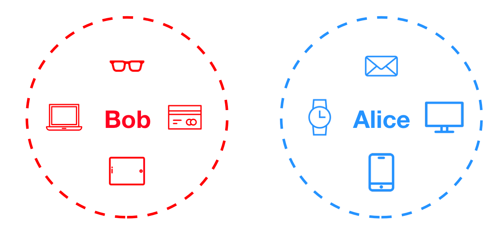
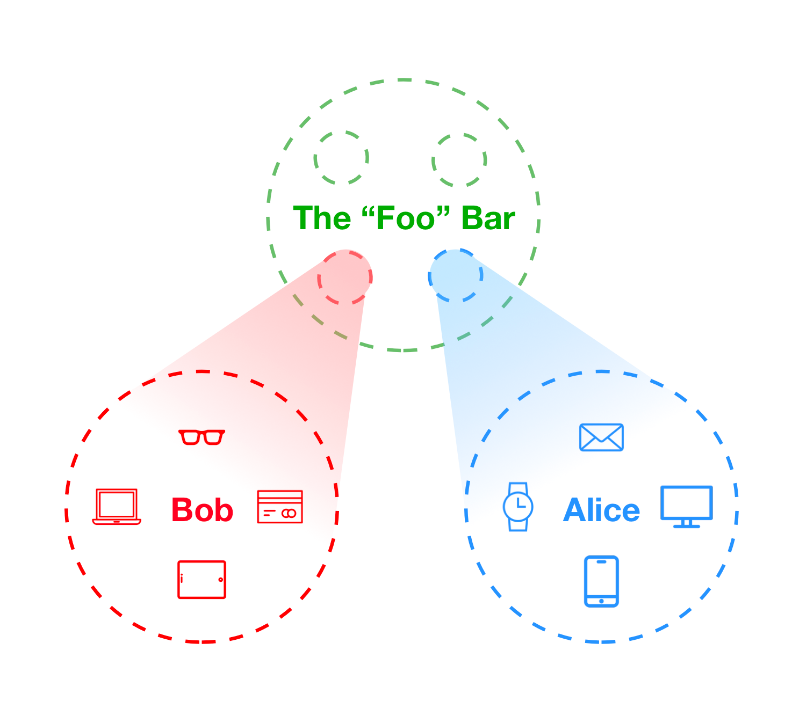
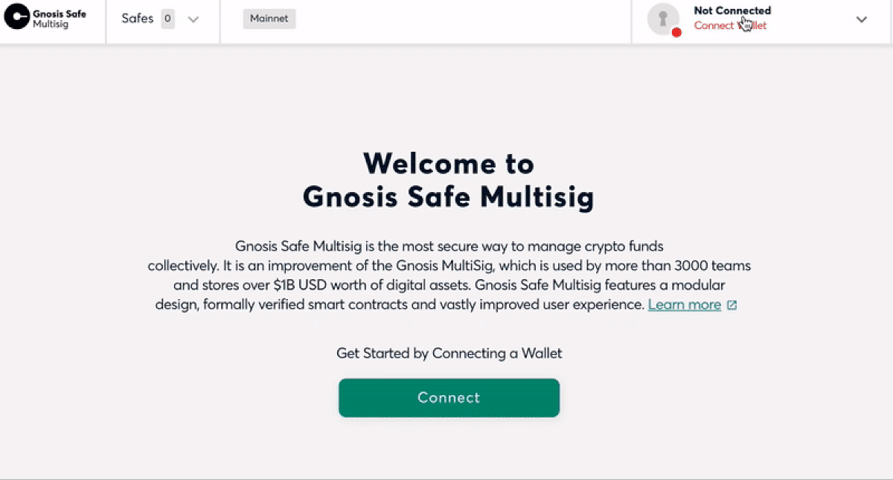
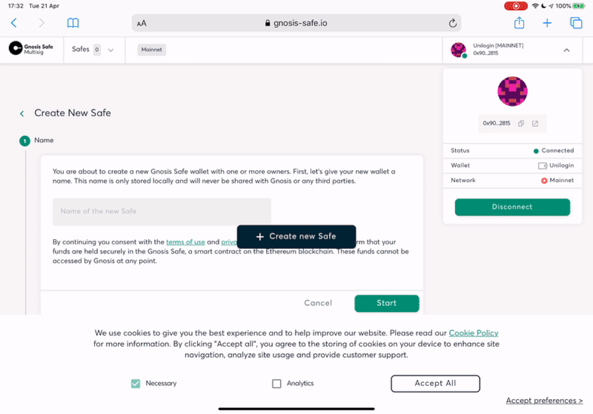
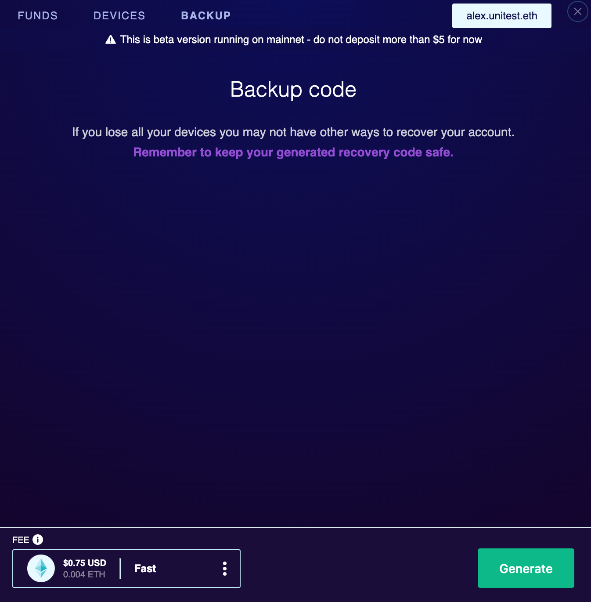
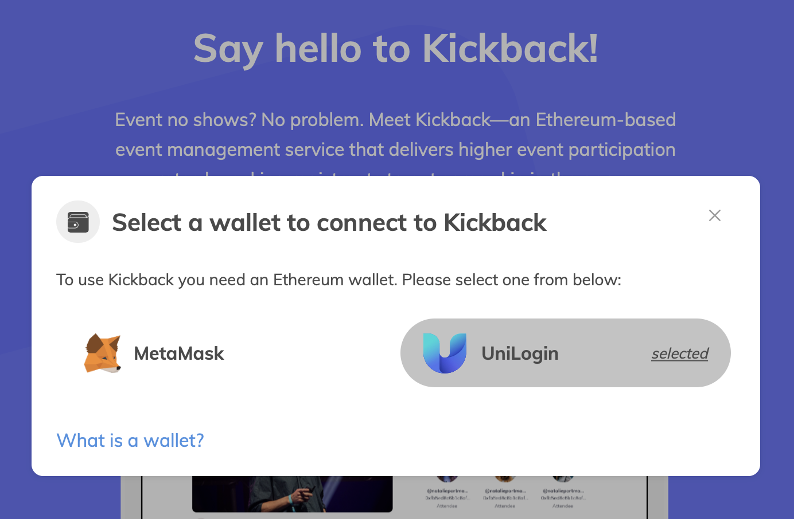

Despite challenging times, our team is doing our best not to slow down. After tackling the nuances of remote work, we have been focusing on stability and polishing [UniLogin](https://unilogin.io/).

Meanwhile we are happy to see that some integrations we’ve being working on are going live, namely [**Kickback**](http://kickback.events) and [**Gnosis Safe Multisig**](https://gnosis-safe.io/app).

But wait, didn’t we already [announce we were using Gnosis Safe](https://medium.com/universal-ethereum/universal-login-beta-3-gnosis-safe-support-more-9b72be0e01f8)? To explain, let’s clarify some terms.

Besides their prediction markets and exchanges, the Ethereum development company Gnosis has also built two widely used multisig contract wallets: the original _Gnosis multisig_ and the newer _Gnosis Safe_, which supports etherless transactions. The latter is what we use internally as our contract-based accounts.

But Gnosis also offers Gnosis Safe as a frontend service for teams, so they have an app named _“Gnosis Safe Multisig”_ (no relation to the previous “Gnosis Multisig”). The Gnosis Safe Multisig app, which was formerly named “Gnosis Safe for Teams”, allows you to create and manage safes from MetaMask or other service providers, now including [UniLogin](https://unilogin.io/), which is _itself_ a multisig.

### But _why_?

<figure>

<figcaption>An identity picker concept from 2014 that would allow multiple addresses for each user “profile,” including one for a collective account.</figcaption>
</figure>

Is this just a curiosity to make a point about daisy-chaining contracts together? **Not at all!** In fact, the idea of modularity and that every account would eventually be a rich, smart account has permeated Ethereum development since the early days. You can see this from this screenshot from my [2014 presentation of a vision for an Ethereum browser](https://www.youtube.com/watch?v=IgNjs_WaFSc) at Devcon0. In fact, when Geth was first developing account management, it was believed that public key pair accounts would be just a temporary measure and that in less than a year most people would have migrated to what we then called “proxy accounts.”

This goes deep into the heart of what an “identity” is. What makes you “you” online?

On the traditional web, it’s about authorization: proving to a central server within their reasonable bounds that you are the correct person, with increasingly hard challenges (a session cookie and, if that fails, a username and password, then a “forgot password” flow, and then sometimes you might be able to escalate it to a human in the help desk).

In the crypto space, traditionally it has been a very binary choice: if you have the private key, then those are your coins. If you lose access to your key, or if someone else gets access to that key, then too bad, you’ve lost them.

<figure>

</figure>

It’s our belief that in a decentralized world, the concept of “you” will be a constellation of devices and keys that all agree to slowly expand. Your phone, your laptop, your tablet, an email, a smart card, maybe someday a smart passport, your watch, eyeglasses, or any other smart wearable will be added to this constellation of your identity. Each device (and each app in each device) holds a single untransferable key that is authorized to do a few actions on your behalf and enables you to vote to add or remove devices to that identity or expand these permissions. **Your digital identity is a democracy made of your devices.**

<figure>

</figure>

If Alice and Bob wants to start a common enterprise, let’s say a bar and restaurant called “Foo,” they should be able to control that identity together in a similar fashion: for some actions (like posting on a social media app) one of the keys should be enough to authorize it, for other more important actions (like moving funds) they would need multiple approvals.

What if now the Foo Bar wants to vote in a trade union of local bars? Or if the local trade unions want to do an assembly vote on state level? Not necessarily all of these collective contracts would follow the same rules, but the important lesson is that they should be infinitely scalable, from the small decision of which of your devices to authorize a transaction, up to who has a right to vote on the global election.

### In practice: how do we get there?

Enough with the theory, how does it look today?

1. Go to the [Gnosis Safe app](https://gnosis-safe.io/app/).
2. Click connect to wallet > Show More > UniLogin.
3. Select your username. If you already have a login it will connect you to one, otherwise it will create one for you.
4. **If you are in the US, you can now use Apple Pay,** thanks to our Wyre integration! Otherwise you can always use the excellent Ramp in Europe or just use crypto if you are already onboarded.

<figure>

</figure>

As soon as the transfer is detected, a new account will be created for you, which uses Gnosis Safe behind the scenes. Now to create a _new_ Gnosis Safe, just click “create new safe” and then follow the instructions on the page. **When you are asked for a list of owners instead of hunting down Ethereum addresses to copy paste, just type your UniLogin username**! Whenever you are using UniLogin you always get assigned an ENS name on account creation, and since this page supports ENS lookups, all you need to do is type the given name and the right account will be found automatically.

<figure>

</figure>

This will create your second level multisig, from your personal level multisig account. It doesn’t look that complicated does it? If you’re curious to see how it looks like technically, [check the transaction that generates the safe, from the first one](https://etherscan.io/tx/0x6c17dcfce2d2c38861333cb2c4427c49bd58f73451f5d24ecca812678c52026e#internal).

**Warning: Don’t put more than a few dollars into your account yet.**

<figure>

</figure>

Some browsers (like Safari), are changing their approach to local storage and are clearing it with more frequency in order to combat tracking. So you might get logged out and without access to your main account. To make sure that this doesn’t happen, make sure to download the “recovery” key PDF.

This should not happen in most browsers at the moment but we are changing the user flow to make sure this is more prominent to avoid user losses.

### Also try it on Kickback!

We are also happy you can use UniLogin with our good friends from Kickback too. Just go to [**kickback.events**](http://kickback.events) and select “UniLogin” as your wallet option.

<figure>

</figure>

#### Integration with Blocknative

Both Kickback and Gnosis safe use [**Blocknative’s OnBoard.js**](https://docs.blocknative.com/onboard), which is why if you are already using it, add one configuration line to integrate with your app (see line 5 in the snippet below):

The Blocknative team helped us to improve usability by giving users instant feedback during onboarding when ether is being transferred into an account, even before a transaction is mined.

### Follow us!

To make sure you don’t miss the next posts in the series, follow us [Medium](https://medium.com/universal-ethereum) and [Twitter](https://twitter.com/unilogin).

### Pilot program

Still not signed-up for our Beta program? Fix it!

[Join our Pilot program](http://tiny.cc/unilogin) 👮🏽 🛩

---

[Turtles All the Way Down: Multisigs Owning Multisigs](https://blog.vandesande.design/turtles-all-the-way-down) was originally published in [UniLogin](https://medium.com/universal-ethereum) on Medium, where people are continuing the conversation by highlighting and responding to this story.
