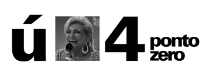

<figure>

</figure>

web 4.0 vai ser quando toda a informação estiver bem organizada, todos os metadados estiverem completos, todas as redes sociais estiverem saturadas, todos os artigos sobre o assunto forem escritos, a internet se desintegrar em oxigênio, o browser se tornar desnecessário, e pudermos, finalmente, seguir em frente com as nossas vidas nos preocupando com outras coisas mais relevantes.

Eu desejo um 2008 com menos hype e buzzwords e mais conteúdo para todos vocês.
