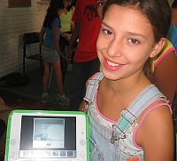

<figure class="float-right" style="width:50%">

<figcaption>No Classmate PC vs OLPC XO?</figcaption>
</figure>

Last Friday the Brazilian Government nullified the December laptop bidding that was partially won by Positivo Informática with the Classmate PC laptop, alleging the final US$360 per unit price was too expensive.

Although it never published what was the reference price it expected, some government officials have compared to the US$199 Uruguay paid for each XO Laptop unit. SIMM, the company with the exclusive distribution of the OLPC in Brazil had offered the XO for US$387 a price that David Cavallo said it was the minimum they could offer at those conditions.

And the auction conditions were in fact very different from Uruguay so the price comparison is almost unfair. For one, Uruguay centralized all shipping to one location and distribution would be done by the government.

In the Brazilian case laptops were to be shipped to different states in almost continental sized country, including some Amazon states that are only reachable by air or river. Other key differences go in the three year warranty that the Lula Government asked and finally the import tax breaks that were promised but never delivered.

At the moment the future of the Um Computador por Aluno (One Computer per Student, in Portuguese) laptops is uncertain. Brazilian Newspaper Folha speculates that the next bidding might have fewer requirements, ask for fewer laptops or finally increase the allotted money.

In the last month, the OLPC Brazil community hasn't stopped analyzing the meaning of the Classmate partial win of the now-cancelled bid. Some highlights:

<figure class="float-right" style="width:50%">

<figcaption>She still has XO hope</figcaption>
</figure>

- Although many have accused Intel of dumping the price of the classmate to win over the XO, this possibility found more ground in the hearts of the conspiracy theory believers than in the math of any rabid OLPC defender.The lower price by Positivo was achieved by more clever business tactics, knowing the Brazilian tax reality and doing local assembly. Positivo responded by saying that they are ready to get the price down to US$300 if some tax-breaks apply.
- An interesting fact has emerged: when adding all the 4,000 hours the laptops are expected to be used, each XO laptop is expected to consume US$45 dollars worth of energy, while the more power hungry Classmate would consume US$90. It's a small difference but in such a tight race, 45 dollars can tip [TCO calculations](http://moourl.com/a349u) to the other side.
- Before the auction took place every hardware manufacturer was complaining for some requirement that should or should not be, which of course always coincided with something that their own product would have. One of the most intriguing was a complaint by the Telecomm industry on the requirement of Mesh Networking. The fact is that some Cell phone carriers were willing to offer phones as tools to bridge the digital gap. On a pay per minute basis, of course.
- The most expensive offer was done by no one other than Sony. This Japanese company was willing to equip every Brazilian student with a feature- full Sony Vaio for the modest fee of over 1 billion US dollars.

In related news, the teacher Léa Fagundes, responsible for the Brazil pilot project was just awarded a Unesco Prize for her works on technologies in education. The award was given (along with another for the singer, songwriter and Brazil's minister of culture Gilberto Gil) in a special event held to celebrate Unesco's 60 year anniversary..
