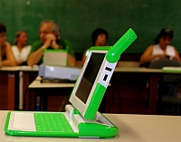

<figure class="float-right" style="width:50%">

<figcaption>Brazilian classrooms of tomorrow?</figcaption>
</figure>

Yesterday was the first day of the auction process for the Um Computador por Aluno project (One Computer per Student, in Portuguese). The process was suspended at the end of the day inconclusively and can drag for two more days.

The lowest offer was at 71.2 million dollars which prices every one of the 150,000 laptops at US$475 which was deemed as unacceptable by the house. Over 8 proposals were made from prices ranging from $500 to $1,600 dollars, but the identity of all bidders will be revealed only after the auction is over.

The whole process is being very open, and this was embraced wholeheartedly by the [open source community](http://lists.laptop.org/listinfo/brasil) which followed the auction site as if it was a twitter account. All bids and messages from the judges are posted online and can be followed by anyone with an internet access and every half hour updates were posted to multiple OLPC related mailing lists.

From there they where dissected as everyone tries to make sense of what, in the end, makes the price of one laptop. And finally all price changes were documented in an [online spreadsheet](http://spreadsheets.google.com/ccc?key=pH0vKjJkMrh3kdYXJ2dlaJA&hl=pt_BR&pli=1) that also converted the prices from Brazilian real to US dollar.

The price of US$475 ( R$855 ) include shipping, maintenance and taxes, lots of taxes. In Brazil all electronic imports are charged at least 60% percent over their sales price just to cross the border. Take in account other duties, including sales and that\`s the reason this is the leading country in the international [iPod currency index](http://apple.slashdot.org/article.pl?sid=07/01/24/0133240).

This contradiction, where the government cannot afford to pay its own taxes where previously known and led to some Government officials to declare their intent on making the educational laptop duty-free. Nothing official was arranged before the start of the bid which led the bid judge to clarify that all taxes should be taken in account. The taxes could be lifted later for this or future purchases, bringing the total cost to considerably lower.

If OLPC win this game this might mean much more than 150 thousand laptops out of quanta. The UCA project main goal is to achieve a total _annual_ order of 12 million laptops. The process will end in the 20th but government official said the result can be published as late as the 24th.

Will OLPC find a 150 thousand present wrapped under it's Christmas tree?
