And in general more about how I approach the UX work

While I’ve been an ethereum evangelist for the past 6 years (it feels so weird to type this!) I have never tried selling people on the idea of buying any coin., because while I am a believer (and hodler) of many assets, and an avid user of DEFI in general, I’ve been always more excited about other non-financial promises of blockchain general computing. Among them, blockchain games, to the extent I said this back when “games” in ethereum were either casinos or cryptokitties:

What I want from blockchain games:1) be a good game first2) explore what makes blockchain unique3) design around the limitations4) persistent always on world 5) players own the game, the items and experiences6) allow anyone to design and improve the game7) embrace bots

A new game I’ve been testing out (a bit excessively) last week, Dark Forest, hits almost all of these except for a few points that they could very well explore better when it’s moved from a testnet into a layer 2 like xdai (owning NFTs, universe persistency, bots). And it has the very interesting twist that uses ZK-Snarks for creating a hidden information game.

It’s a space exploration game with no graphics: a classic formula of exploring the universe to find unconquered planets, and then using the resources from these planets to explore and conquer more planets. The game map is derived from computing a hash of coordinates, which means that the universe is pre-determined the moment a salt is decided, but can only be found by computing all these hashes, so exploring is a sort of proof of work. You then move from planet to planet not by publishing the coordinates in which you’re moving, but rather you submit proof to the chain that you are doing a valid move, using zksnarks circuits. But most importantly for the purposes of this article: **it has terrible user interface.**

<figure>
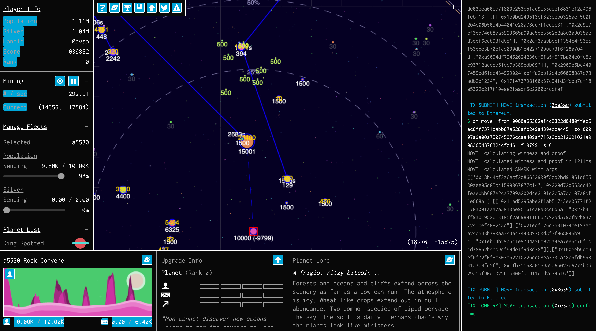
<figcaption>Really, what’s going on here?</figcaption>
</figure>

A great compelling idea of a software, with very complex technical concepts that need to be explained to the end user, with a terribly confusing user interface designed by engineers? That’s the sweet spot for a UX designer like me. So let’s go and explore not only how to improve it, but how my process works so that maybe you can apply for your own software.

#### #1 the difference between the “t<em>heme”</em> and **_the “experience”_**

A theme is how the game purposefully looks. Terms like “ugly”, “retro”, “pixelated”, “text heavy” relate to the theme and are all valid options. Often when developers (and inexperienced designers) talk about making a better “interface” they’re talking about having nicer fonts, 3d buttons, shadows, colors, etc.

<figure>
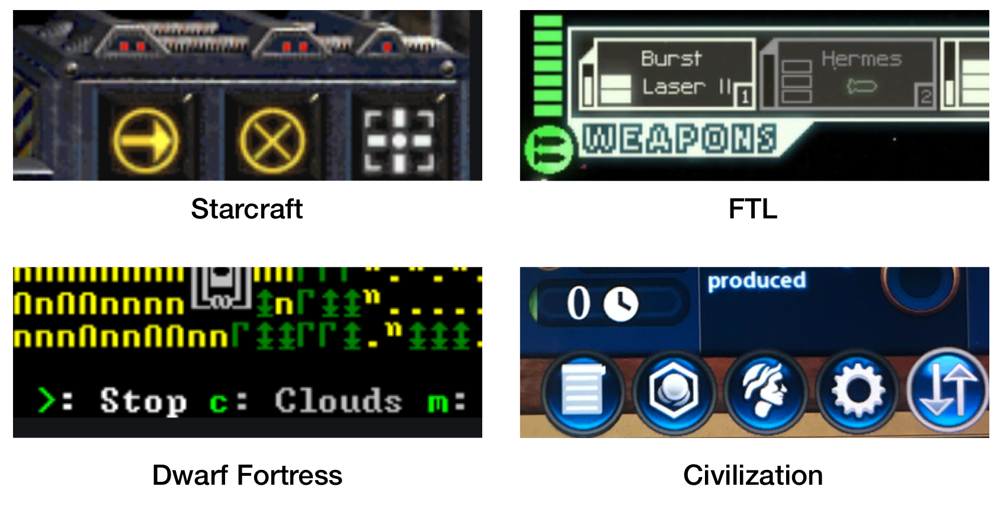
<figcaption>There are no right way of picking a theme for a software (but there are a few <a href="https://www.reddit.com/r/nostalgia/comments/2lxi5h/album_of_90s_windows_media_player_skins_xpost/">wrong ways</a>)</figcaption>
</figure>

The Theme (aka a “style” or called a “skin”, when it can be changed by the user) is an artistic decision. Your game can decide to look like an old school BBS or a bubbly display from the future. While of course those decisions have technical reasons behind often (it’s easier to create pixelated sprites, or make changes on a text heavy interface when you don’t have a designer on staff) they are still stylistic options. Things that you can even set for a user preference are usually themes. But if you are discussing “this can be done with a less clicks” or “the user is confused by this” then we are in the realm of user experience.

I find the latter much more interesting, because often you can offer solutions that are even less work to implement, but can drastically improve 10x your user acquisition. Also, a developer might feel they are not capable of “designing” a new theme, but they can always be empowered to learn to optimize the experience like one would optimize an algorithm.

#### #2 If you need to explain it, then you’ve failed already

The first experience is fundamental for any software development and is often renegated by developers because it’s the screen they **never** see, full of empty and unselected stuff. This is the first screen a user would see when they log in the game:

<figure>
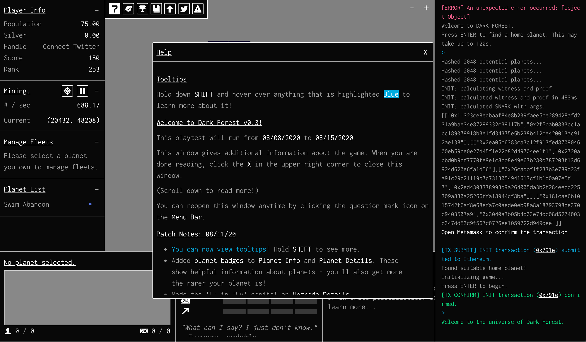
<figcaption>WTF am I looking at??</figcaption>
</figure>

<figure>
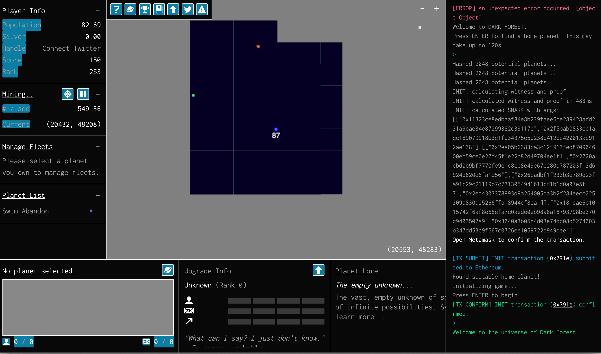
<figcaption>First screen after closing the pop up. The black slowly expands as you “explore” but you wouldn’t know that.</figcaption>
</figure>

You have a terminal on the right, a lot of information about planets and fleets. You have a popup with crucial information on how to play, but the user will probably close it out before it reads it because at this point it’s suffering from information overload and wants to go to the game already. They probably don’t know at this moment but this is the most important piece of UI they should look at first:

<figure>
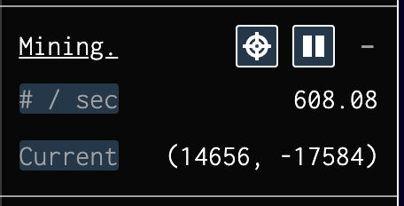
<figcaption>Is this a game or a cryptocurrency?</figcaption>
</figure>

Unlike many panels this one has no lore, no explanation, no story and set of minimal and confusing buttons. Yet this should be the first thing the user needs to learn about. _“Mining” is a bad metaphor for explaining Proof of Work crypto currencies_ _and_ **_it’s even worst for a game_**, even if it’s technically correct. It gets worse because the player will find planets with the “silver” resource which grows over time but is _completely unrelated to this mining_ panel! In this case you are using your computer CPU to explore the map and find planets, so we can simply call it “explore”.

<figure>
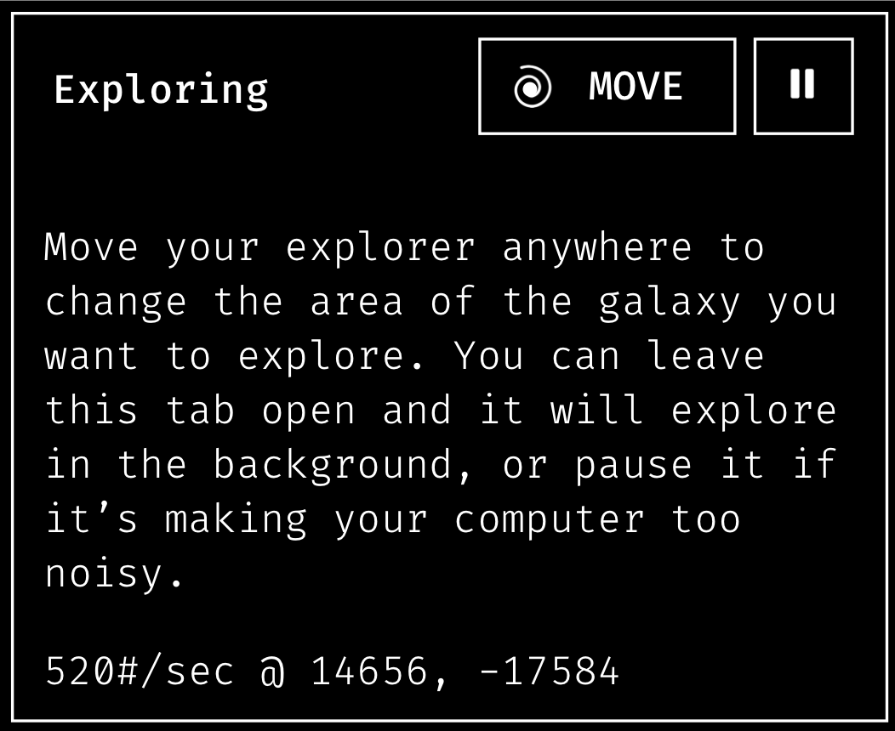
</figure>

Notice that I did not change the “hacker style” of the game, kept the black and white and text heavy, because our focus is UX, not changing the theme. That should be a separate effort. **Sometimes “redesigning” can be as simple as calling stuff other names.**

I renamed the panel to “explorer” and created an icon for it. I chose an spiral inspired by the idea of a Sophon, a particle-sized computer that is invisible but is used to gather information on the [Dark Forest book](https://www.amazon.com/Dark-Forest-Remembrance-Earths-Past/dp/0765386690/ref=sr_1_1?dchild=1&keywords=dark+forest&qid=1597680804&s=books&sr=1-1) (I would not use the actual name, because while this game is inspired by the Liu Cixin trilogy, it’s not meant as an official license of the IP). The icon itself doesn’t matter, but it’s important to show another copy of the same icon on the map, showing it moving around as it explores the unknown region of the map. In the first phases of the game the most important thing the user should do is move the explorer around and drag the map so they can understand what they’re doing. In fact, since most of the panes in the UI were empty or context dependent, the whole first UI could be reduced to this:

<figure>
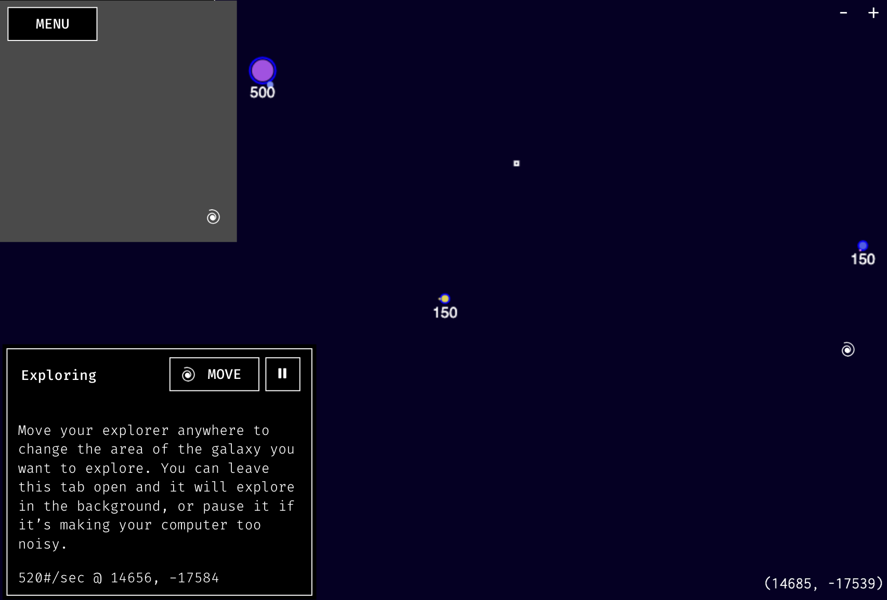
</figure>

The User doesn’t need to be explained the UI because the UI has very few buttons on it. He can can move the explorer and drag the map around to find new planets. Once he finds them we can have more panels appearing with the context. Now where did the rest of the interface go?

#### #3 Kondorize your room

Sometimes you don’t need a designer, you need [Marie Kondo](https://www.amazon.com/Life-Changing-Magic-Tidying-Decluttering-Organizing/dp/1607747308): often a lot of great work can be accomplished by looking at all your elements with a fresh eye and asking yourself where they belong, and what goes with them. And if they don’t bring you joy, get rid of them. Often a common mistake is that developers start by making menus and then filling them up, before realizing if they actually _need_ that particular piece of UI. Now let’s look back at our previous UI and understand better what it relates to.

<figure>
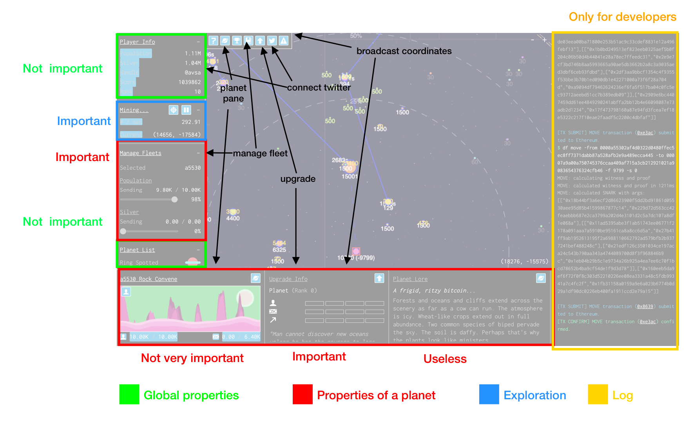
</figure>

Related information is all over the place. Some important panes use very little space, while some completelly useless ones (“planet lore”, a randomly generated description of planets, or a “landscape” view) uses a large amount of space. Panels that are very similar in nature: upgrading a planet or managing your fleet are far apart.

At least 20% of the screen is taken by a log window. While this is probably important for developers and sometimes even for the players (if their transactions fail, for instance) it’s inneficient use of space. For developers it should have a toggle visibility hidden somewhere so that most users don’t see it, and any important warnings meant for end users could be put in a temporary notification hover in the top right. Global properties like your score, or a list of top found planets are rarely needed and could very well be hidden inside one click. Another terrible usage is the toolbar which basically has information replicated elsewhere:

<figure>

<figcaption>It looks important enough to be on top, but isn’t</figcaption>
</figure>

This toolbar contains help, some links to panes that are open elsewhere (top planets, upgrade, manage), a link to a pane not found elsewhere (top players) a link to connect to your twitter (which could be inside your profile) and another for broadcasting coordinates to a planet. While this last one has some questionable strategic reasons and is very aligned with the lore (without getting into book spoilers but the dangers of broadcasting the location of a planet with intelligent life is the driving force in most of the Liu Cixin trilogy), this option really just creates a tweet with the numerical coordinates and could be moved inside some other pane.

**Often when designing a UI developers first decide on the navigation and then decide what goes in there.** This is a common error and often leads to a navigation that is unnecessary, specially when they start adding buttons for “coming soon” features.

Now that we looked at our closet drawer, what happens when we separate all the socks, shirts and pants in their respective places?

<figure>
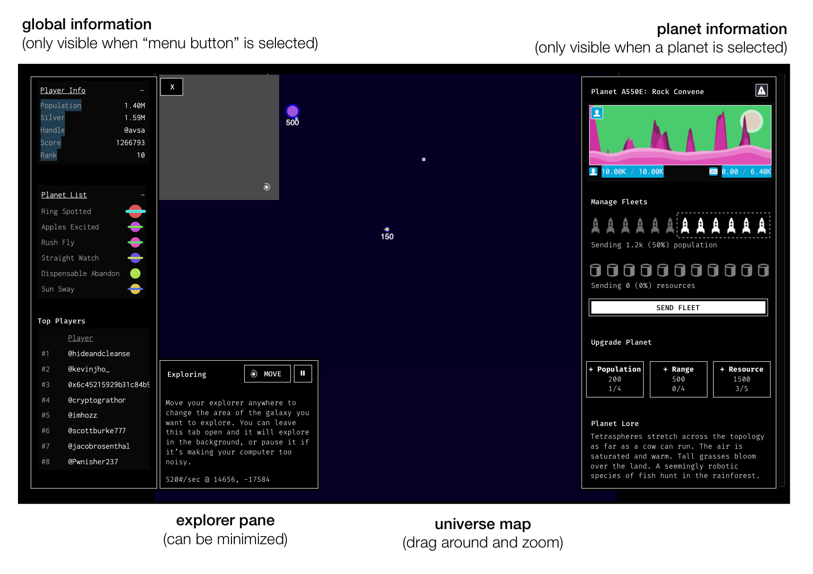
</figure>

All contextual information (including “broadcast” option) _only appears on the right when a planet is selected_. All other global information appears on the right _when the “menu” button is selected_. Other options, like showing the console, could be hidden in there too. This allows most of the interface to be hidden only when the player needs to look at it.

The main lesson here is: **figure what stuff you actually need to show user, and when. Group stuff together, hide stuff you use very rarely, throw away stuff you never use.** It works for your closet as well as your UI.

#### #4 Discoverability: Less is not always more

Finally let’s talk a bit about the proposed contextual menu:

<figure>
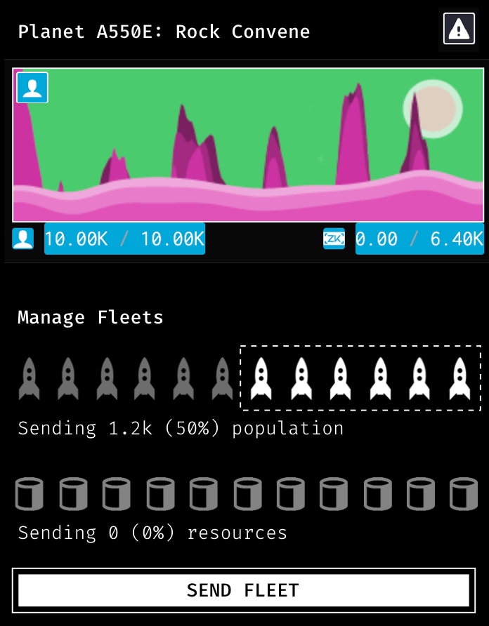
</figure>

As an exercise, I’m not proposing any new features and gettind rid of very few. Even stuff that is relatively useless and is there just for the flavoring, like the planet “view” and lore is kept there. A small change is the addition of a new button, “send fleet”.

Sending spaceships around is the essence of the game, but surprisingly, _there’s no button to do it._ The way to achieve it is to select a planet, change the slider to selecting how many rockets to send (I made the slider more explicit about “selecting”) and then dragging from one planet to another. While dragging is quite an efficient way of moving troops, it’s sometimes flaky (clicking and dragging on the map is also the way to navigate on it) and it’s hard to find that out by yourself unless you read the help menu. So in this change there’s an alternative way to achieve that: click the origin planet, select the rockets to send, click send fleet, and then click on the destination planet.

While it’s a lot more clicks to achieve the same task, it’s no doubt a better approach because it allows the user to figure out each step and understand what is happening on it. The old way of dragging should be kept, mostly as a shortcut for experienced users.

The principle **here is that discoverability is more important than efficiency, and sometimes adding extra steps or UI elements to a flow is a net positive**.

#### #5 Polish polish polish

A lot of developmnent work is just grinding details the user will never notice over an over. For example, for a text heavy interface, text in Dark Forest is quite messy. Certainly a better text placement algorithm would help avoid them one on top of the other. Another very important strategically important UI element is the radius circle, that, when you select a planet, tells you how far your ships can travel (the grey circles below), Ideally you should be able to see the full circles and they are selfexplanatory:

<figure>
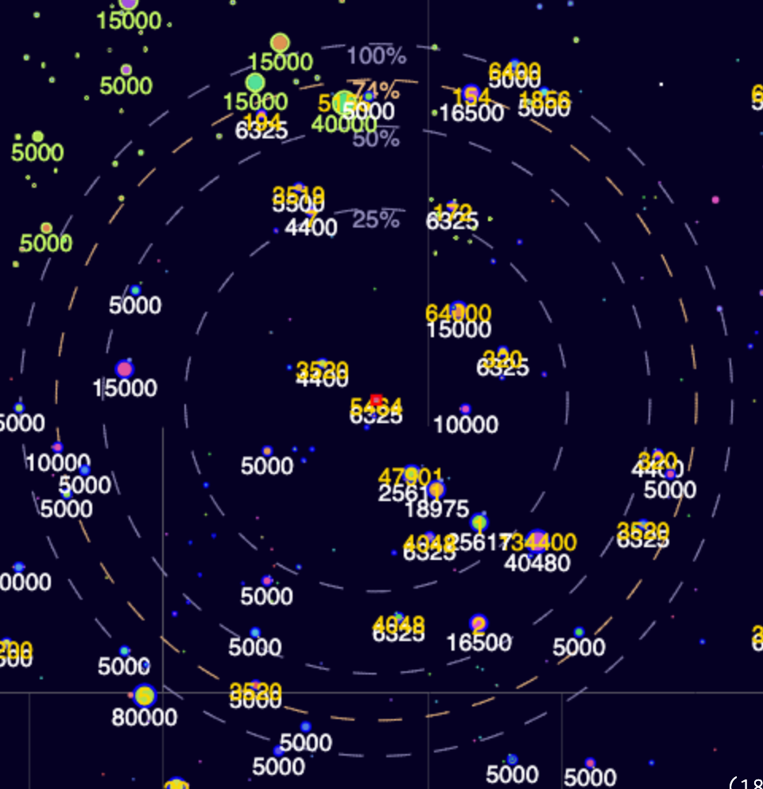
</figure>

But in most circumstances you’ll see something more like a mess of lines and semicircles with very little explanation, because the text is off screen. Again, text placement algorithm is important.

<figure>
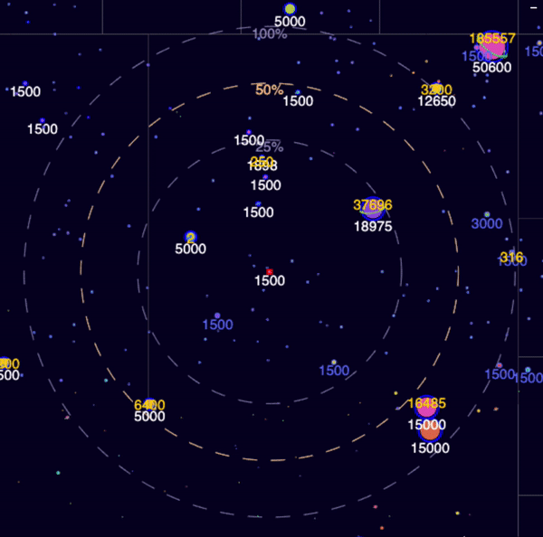
</figure>

When you select how many ships to send from a planet, a new yellow circle expands, going from 0 to 100%, which is sort of redundant with the current grey circles and gives a false impression that it represents how far your current troop can go. Instead a much more useful moving circle would be to show multiple lines showing absolute numbers: “by this far you’ll have a power of 500, here you’ll have a power of 150” which is the final information you need to decide where to send your fleet.

I could on in tons of small details like these that would help the UI get less confusing and many of these are probably already in the backlog of the developers. But my point is **a design is not something you build on photoshop once and throw it over the wall to developers: it’s a constant interation of back and forth of finding small ways to improve your product experience, which you’ll only discovering by using it a lot. Be a user.**

#### #6 Designers: learn to talk to developers

Most of this post is intended to developers or designers learning the ropes. But this is a point addressed to designers: know how to talk the language of your audience. Before jumping and trying to make a beautiful screen out of something ugly, try first really understanding the process in which decisions were made so that the UI looks like that.

Often designers see themselves as the “pure ideas” person, while developers see designers as someone to call when the house is already built so they’ll pick which color to paint the walls. Ideas are only as good as they can be implemented and they need to be understood and adopted to be implemented.

Notice that in this whole post I’ve avoided talking about the many ways in which I’d improve the game itself, or even trying to make a nicer looking planets and a fancy theme. Everyone who builds anything has plenty of ideas of their own, and if your fancy theme is a hassle to build, it will never get high priority. Sometimes a designer just needs to be the person tidying up the room after the party.

_All icons come from open libraries like_ [_The Noun Project_](https://thenounproject.com/)_._
