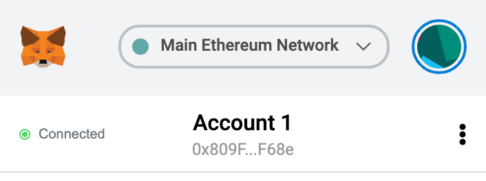
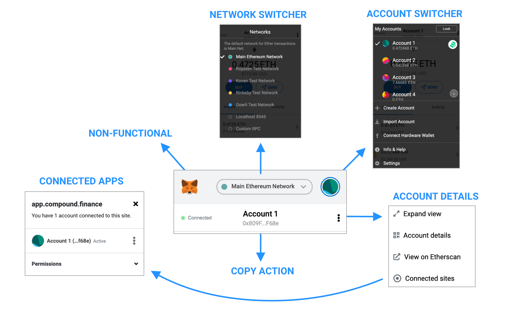
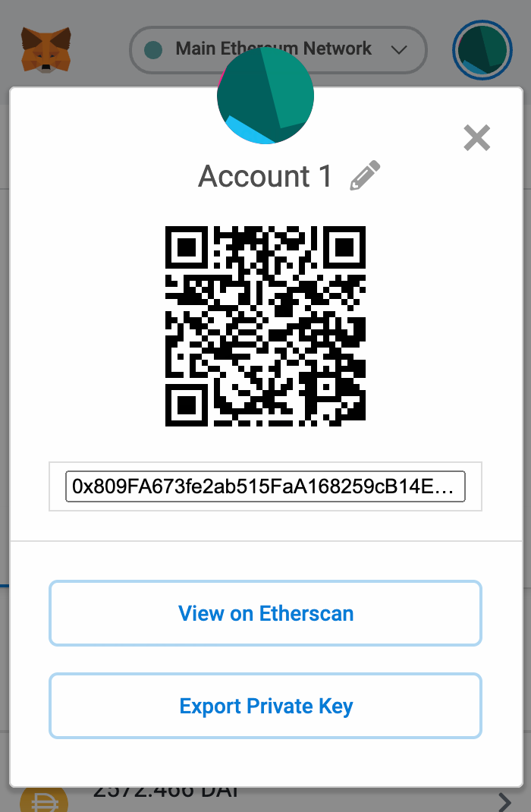
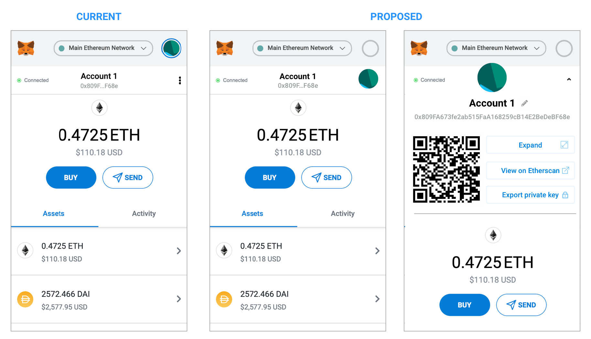
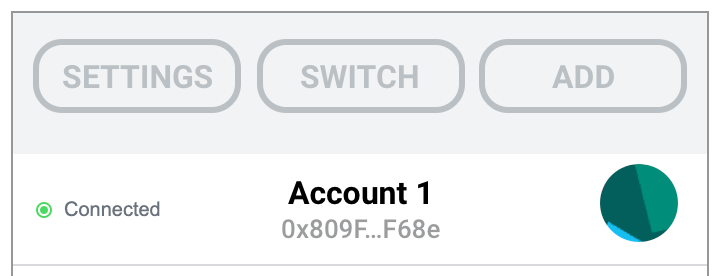
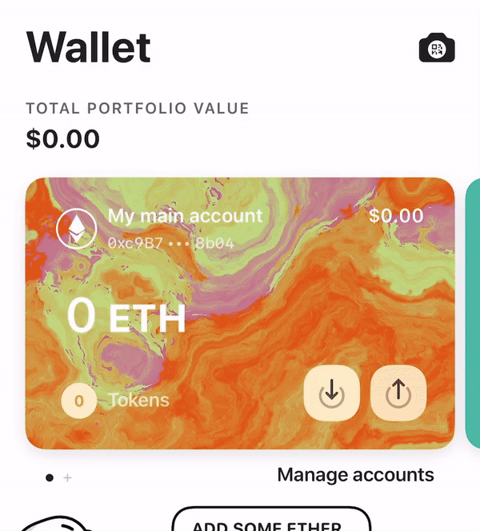
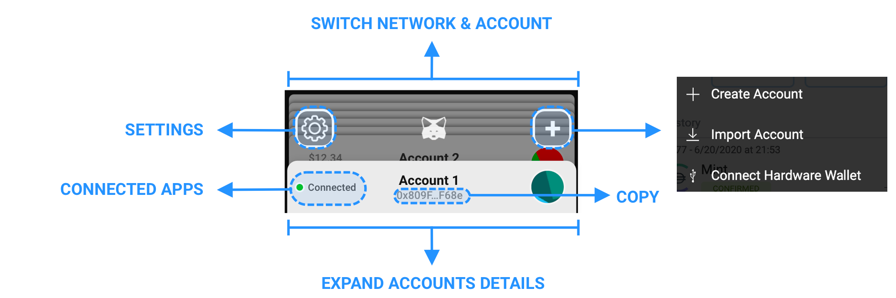
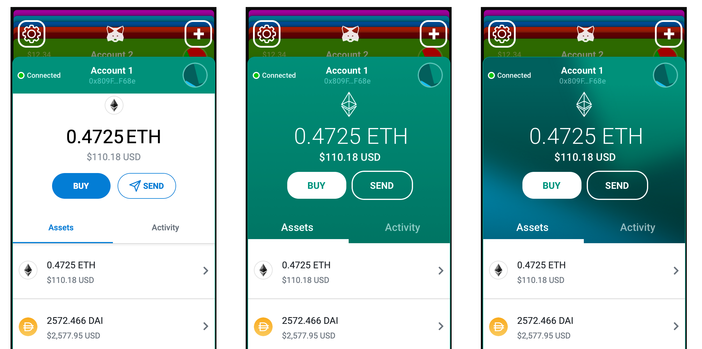
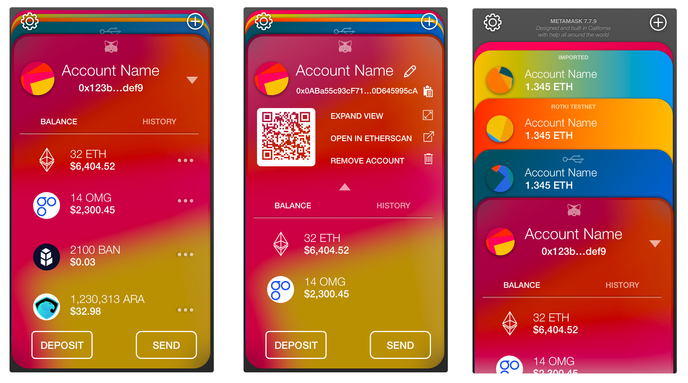

Making software—especially on the blockchain—that is both powerful and usable is very hard, [I know](https://blog.vandesande.design/sunsetting-mist). And sometimes we plan a lot of our UI but new features get added, some changes are done in the implementation and while we have ideas on how to improve that, they get pushed to our long backlog. So this isn’t intended as anything but praise at what the great work the team at MetaMask has been doing. I hope this analysis could be useful and due to the great utility MetaMask has on my life at the moment, I’d like to share it. So let’s talk about specifically this little bit on the app:

<figure>

<figcaption>MetaMask version 8.0.0 connected to an app</figcaption>
</figure>

Arguably, the most important piece of real estate of the app is the header and menu and it contains the following elements:

- **A MetaMask logo.** Despite looking like an icon and being the first thing we see, it is not clickable nor provides any information
- **A network switcher**, using most of the space of the top bar
- **An account switcher/menu.** The same menu also contains links to add new accounts, import an account, connect hardware wallet, settings and info (which is just another menu inside settings menu). That’s a lot for a menu with an abstract icon.
- **A connection status** (new on 8.0.0) tells you information about which apps can see your account.
- **Account title** and address, clicking it will copy the address to the clipboard.
- **Account menu**, with the options to expand (opens MetaMask app in tab), account details page (more on that later), open in etherscan and a link to the connection menu (the same action as clicking on the connection status bar)

So, in a diagram format:

<figure>

</figure>

So, **we have _six_ click areas on the topbar opening _four_ menus.** However the _noblest area, the top-left doesn’t provide any information or functionality_ and _the largest click area on the top offers a functionality that is probably only used for more advanced users_ (how many dapp users want to set up a custom rpc or a localhost node?). Account switching is probably done more often by users (and we should encourage them to, for privacy!) but is hidden in a more neutral looking identicon. They are rather _inconsistent_ in behavior too as some of these will create actions, others will expand menus. Say a user needs to see his seed phrase, it’s not very obvious that this path starts at the weird abstract green art on the top right corner.

Also the “account details” pane is interesting that it offers four actions, two of these will open a new tab (expand, etherscan), one of them will open the same menu that you get by clicking on the “connected apps” menu and finally one will open the “account details” pane.

<figure>

</figure>

And the Account details pane is a thing on its own: it replicates the same information we were looking at before, but now in a modal. It contains the following elements:

- **the identicon:** notice you see it twice now, as it’s still visible on the background
- **account name:** now it allows editing the name
- **The address:** shows more characters and unlike before, clicking on it won’t copy, just select it
- **view on etherscan:** notice it’s a duplicate of an action of the previous menu too!
- **a QR code**
- **“export private key”:** arguably a quite advanced feature, given that most users will just use seed phrases and individual private keys are less useful

This pane is opened from many places, including clicking on the “deposit” button and choosing “crypto”.

#### Suggestion #1: replace the “details” menu with an inline expansion

<figure>

</figure>

Expanded view could happen when you click the identicon, the name, or anywhere on the white bar (except the connection button and maybe the address). This would eliminate both the “account details” menu and “account view” overlay. Reducing the amounts of menus and overlays also reduces cognitive overlay from the user, as is one less place to remember where to navigate. This also keeps consistency, since we are just showing the same information we were showing before, just “bigger”. Actions like “_expand_” of “_open in etherscan_” are still just two clicks away. Clicking anywhere on that top bar would expand it, except clicking directly on the “connect” button or the address, which keeps the current behavior of copying the link.

We’ve also moved our little green friend icon to this bar, since _identicons are a feature of an account, not the app as a whole._ This of course means the top menu has a hole on it now. Let’s explore that.

#### Suggestion #2: unify the “switchers” menus

There are three main actions accessible on the top menus:

- **Switch**: change your current account or network
- **Add**: add a new account from seed, import account from file, connect hardware wallet
- **Settings**: since “info & help” is one level deep inside the main settings menu, it means this button essentially does the same as “settings”

Visually this could be divided like this:

<figure>

</figure>

The first big change I would defend is: **unify switching accounts and networks.** Not only this removes clutter from the app, but _it also is good practice_. You don’t want to be using your main account to sign transactions in a test network, this induces errors (“Help, I accidentally sent to my test account!”), can create replaying issues and reduces privacy as activity between networks can now be linked. Switching to a new network should also switch your accounts (but of course not the other way around). This would also help separate to the user what accounts are used for what and is in line with the common behavior of users so that you can more easily switch from say, playing with a main net app and then quickly switching to a test net app in another tab. When adding a new account the user should also select which network it is for, which also helps hide more advanced options like “localhost:8545”. In the very few cases in which a user might want to use the same account in two different networks, it should be allowed as an advanced feature, and upon first importing new accounts, it would be good for the app to check which accounts have balance or nonces on test networks.

Let’s call these concepts of “cards” in which each account is tied to a given network and contains a balance there. This is executed quite beautifully in [**MEW’s new wallet**](https://apps.apple.com/app/id1464614025):

<figure>

<figcaption>MEW’s app on the Appstore doesn’t allow Testnets, but it’s Beta program did</figcaption>
</figure>

Applying the concepts of cards to MetaMask we would have an interface similar to the following:

<figure>

</figure>

The same functionality is present in the start, but we eliminated all intermediary modal menus, except for a much shorter “add account” menu. Clicking anywhere on the card header will expand it and show more options, clicking on the floating cards (and MetaMask logo) will expand them to allow a picker. Settings and Add account have clear icons. Not only the MetaMask logo is now in an even more important real estate, it serves an important functionality that is on-brand (access to your ethereum cards).

Some use of color can make the cards even more distinguishable. Colors can either be based on card type (main net, testnet, hardware wallet), random based on the address or they can be derived from the identicon itself (below right, we’re just expanding the icon and blurring it, so it works for any type of identicon including blockies)

<figure>

<figcaption>A little color goes a long way.</figcaption>
</figure>

I hope this exercise has been as useful for you to read it as it has been fun for me to work on it. I believe doing these changes would make the main navigation much more consistent, reduce the mental overhead required for users to figure out where stuff is and make the app experience even more interesting. Of course, the final design itself can be tweaked, animation can add another interesting navigation layer and it’s easy to see how it can be converted to mobile. Some tweaks can be done to show more relevant information, like if it’s a “MetaMask account” (derived from seed) or a hardware wallet. This reduces clicks, increases functionality and IMHO looks a lot more interesting.

<figure>

</figure>

> Cheers and thanks for all your work, MetaMask team! Let’s keep building it together for a better and nicer ethereum!
