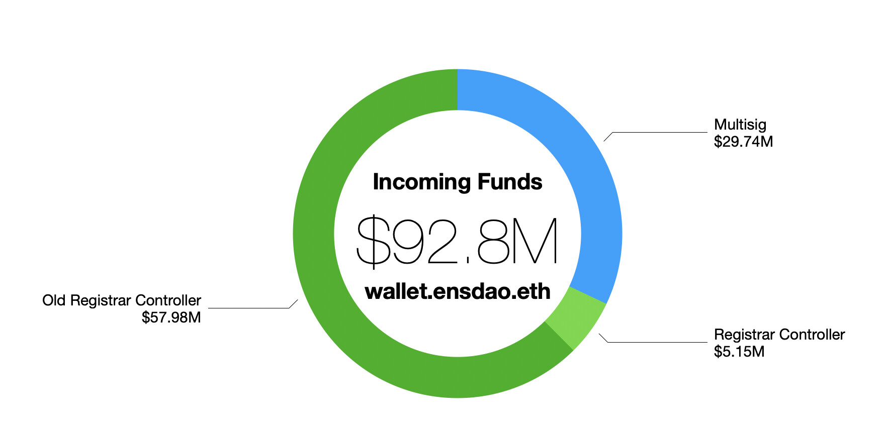
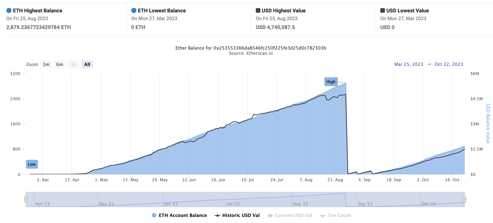
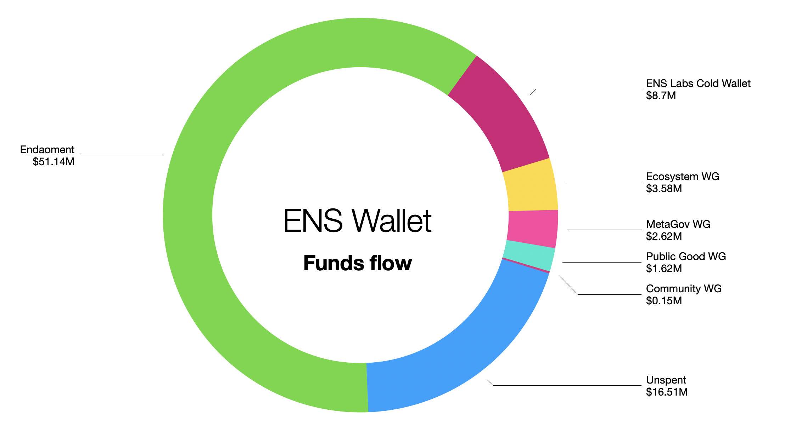
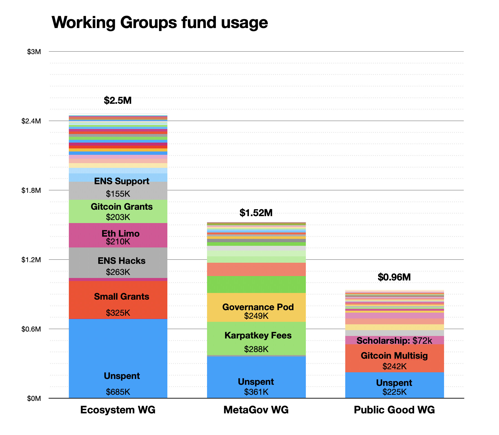
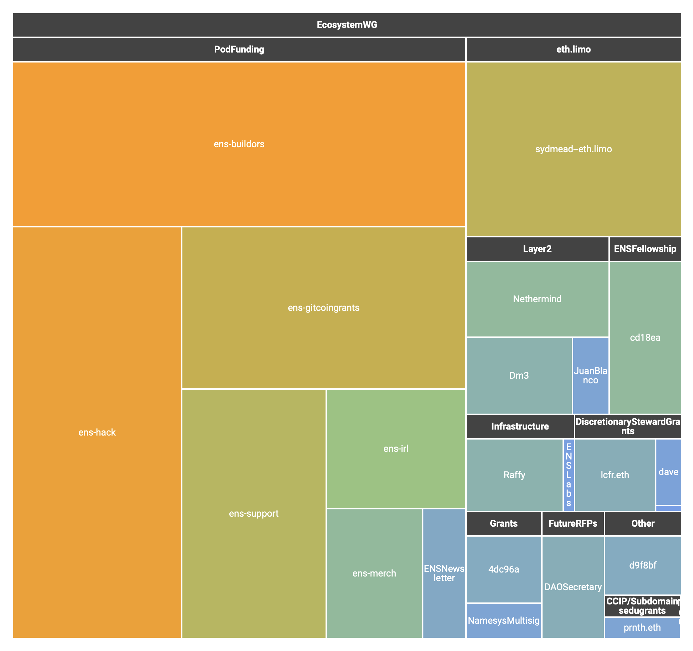

Since we are right now discussing the DAO’s new request of funds to the working groups I think it would be a good opportunity to analyze how the DAO has spent it’s money so far.

First of all, how much money has the DAO received so far?

#### Money In

There are multiple ways to tell this story, measuring value in ether, or dollars, at the current time or then. The method I will be using will be to account only for USDC, ETH (and WETH) transfers and measure them at the day of the transfer.

<figure>

</figure>

Almost 100 million dollars. That’s taking all the ether and USDC transactions coming into the address wallet.ensdao.eth at the time of their transfer. That of course doesn’t tell the whole story: it ignores all the ENS tokens it holds (valued at over 90 million right now but of course that would change if the DAO tried to sell much of it) and because lots of these were transferred in ether then that total value is also relative.

Most of the money came originally from the old registrar controller. But both the old and the new still have a large income of money. Here’s the current [incoming flux of ether for the new and active registrar controller](https://etherscan.io/address/0x253553366da8546fc250f225fe3d25d0c782303b#analytics3):

<figure>

</figure>

You can see that the Registrar controller has an incoming flux of roughly 30 thousand dollars per day, which amounts to almost a million dollars per month! And that seems roughly stable, despite the variations on the larger NFT market.

### Money Out

Now if we measure all the outgoing transactions, then we see that the DAO transferred out almost 70 million dollars and still has 16 to spare in its wallet (again, not counting ENS tokens).

<figure>

</figure>

#### Endaoment and ENS Labs

**Most of that money has been sent to the Endaoment, in two tranches.** I am also ignoring a large transfer of 10k ethers made to Cow Swap (as per EP3.3) because it also had a corresponding incoming transaction of equal value. You can follow up the [Endaoment composition on this Dune Dashboard](https://dune.com/queries/2840308/4743382).

The second largest slice is the “unspent” portion which represents $16M still on the wallet (this adds ether and USDC so it varies).

The third largest slice is for ENS labs, here represented by the address **coldwallet.ens.eth** as “ENS Labs Cold Wallet”, which is the target of the receiving stream of [that was approved in EP14](https://www.tally.xyz/gov/ens/proposal/112764562576314516994943312429834673309292069549953740415731020720942627228986?chart=0).

To clarify, EP14 was $4,197,500 for the year 2022, but more importantly it approved a stream of $11,500 _daily_ to ENS Labs, which can be revoked at any time by either party. Here are all the transactions that sent USDC from ENS DAO to the ENS Labs wallet:

<table>
<tr><th>Date</th><th>Value</th><th>Link</th><th>Notes</th></tr>
<tr><td>April 1, 2022</td><td>$1,291,135.63</td><td><a href="https://etherscan.io/tx/0xc6fc145016ca50d3c7fbded8037d3ecd16620a56183a15a51a775f051edd3aa5">EtherScan</a></td><td><a href="https://www.tally.xyz/gov/ens/proposal/82659277767818009782194204088226418907972756681918239480374274857360772298879?chart=0">EP8 - Reimburse True Names for expenses and tax obligations</a></td></tr>
<tr><td>July 16, 2022</td><td>$2,263,565.15</td><td><a href="https://etherscan.io/tx/0x7c5cbb7c569f50300ed015b3bcfcb304bea6a94b65767fc32eeeabc688bf8378">EtherScan</a></td><td><a href="https://www.tally.xyz/gov/ens/proposal/112764562576314516994943312429834673309292069549953740415731020720942627228986?chart=0">EP14 - Funding ENS Labs Stream</a></td></tr>
<tr><td>November 10, 2022</td><td>$1,349,519.16</td><td><a href="https://etherscan.io/tx/0x7aeb4458d00cf90579042c4b77092387a6c2bde79e9baa6982f304de7ca41729">EtherScan</a></td><td>stream: 117 days * 11,500 $/day</td></tr>
<tr><td>April 28, 2023</td><td>$1,938,319.17</td><td><a href="https://etherscan.io/tx/0x790f484ce3ffb43600509ee802ef69965231399435f85a926b1c220ca48b788b">EtherScan</a></td><td>stream: 169 days * 11,500 $/day</td></tr>
<tr><td>July 4, 2023</td><td>$770,817.11</td><td><a href="https://etherscan.io/tx/0xaabbb846b0032ba66819d83c2c19b8e8b4e1e81b13704c8701819be9355acb3a">EtherScan</a></td><td>stream: 67 days * 11,500 $/day</td></tr>
<tr><td>July 31, 2023</td><td>$310,862.92</td><td><a href="https://etherscan.io/tx/0x84ffcd258ec9145296803c2b56aacfd71298760db5d4a39d55da062caff12073">EtherScan</a></td><td>stream: 27 days * 11,500 $/day</td></tr>
<tr><td>September 7, 2023</td><td>$436,045.35</td><td><a href="https://etherscan.io/tx/0xca8ea1b02f8a53920547600c626866260986c1dfbf42b817c62b37d66c01ffbc">EtherScan</a></td><td>stream: 38 days * 11,500 $/day</td></tr>
<tr><td>October 6, 2023</td><td>$335,314.82</td><td><a href="https://etherscan.io/tx/0x357f99e5766993de99efaa29c15a2cebc9e42470fb5f22e43ddb617ea01314e5">EtherScan</a></td><td>stream: 29 days * 11,500 $/day</td></tr>
</table>

#### Working Groups

Here is the budget of the working groups broken down.

<figure>

</figure>

First of all, for all it’s governance overhead, it’s important to note that while most of the ENS governance calls are related to Working Groups budget and steward selection, that they all combined have received about half of what ENS Labs have and a fraction of what is sitting unspent on the wallet.

Second it’s curious to note the sheer amount of transactions sent by these groups, transactions under 100k are not even listed otherwise it would be extremely busy – and 100k is a lot of money!

Also a third point of note is that by far, the largest line item on each group is actually the money they did not spend. In all cases, they have remaining in their wallet more than they have sent to any individual address.

**Ecosystem** is the largest working group and most of its largest line items are actually sending to other contracts who then forward it elsewhere. Like the Small Grants or Gitcoin grants, these are just ways to offload the governance of funds to other entities, like Gitcoin or the [Small Grants](https://ensgrants.xyz) program.

Ecosystem stewards provided me with even more detailed categorization which allowed me to put this tree map chart of money flows

<figure>

</figure>

It’s important to note that money out is not an expense: I have not tracked the funds inside the pods, how much they were sent out and how much of them remains in the pod (which are still in control of stewards)

**Metagov** on the other hand has larger individual line items. The biggest is Karpatkeys fees, paid to manage the sizable endowment. Notice these are only tracking “transactions that were paid” for the total life of the DAO: fees incurred and not yet paid, or expenses accounted for but not sent, etc, are not shown. The third largest slice is the [Governance Pod](https://etherscan.io/address/0x4f4cadb8af8f1d463240c2b93952d8a16688a818) which was listed as the “governance” line item in the working group’s budget. I am still clarifying what it does and what its purpose.

**Public Goods** is the smallest group and it reflects on smaller checks. Its largest check was sent to Gitcoin and the second largest is the the Scholarship program, where it selected 6 ENS scholars all over the world for a yearly stipend of $1000/month in a super fluid stream.

**Community** working group is a defunct group that was abolished after one term and sent the remaining funds to ecosystem.

### Some conclusions:

DAOs can be a great tool for financial transparency as every cent that the DAO can spend has to be accounted, approved and can be transparently audited on chain. But of course, in order for that to work we need to actually look at it.

- **Large amount of small tickets** It’s interesting to notice the large amount of small checks in the groups. On one hand it means that the groups are doing a good job spreading funds through many different initiatives. On the other hand, a large amount of small checks can be harder to audit and it also means that a group that has a significant contribution to ENS as developers don’t have the chance of getting bigger funds in similar scales as ENS Labs has. I hope to expand that point in a future point.
- **Unspent funds** Most working groups have a large amount of unspent funds. I believe these should be taken in consideration when making requests for new funds. For example the Ecosystem working group is requesting 400k in new funds while they are sitting on over 600k unspent in their wallet.
- **Auditability tools** I’ve done this analysis by downloading the data from ether scan as CSV and playing around in Numbers. Ideally we should be able to build Dune Analytics dashboard and other visualization tools that help visualize these. For example, while the ENS Labs stream has been approved in a vote, I had not seen the full usage of funds until now, and I don’t believe there’s any working dashboard for it.
- **Possible warnings** I believe that exercises in using on chain data like these are important defense mechanism for the DAO. As more money keeps flowing, we need to make sure all the data is auditable and we have the right tools to make sure the funds are being properly allocated.
