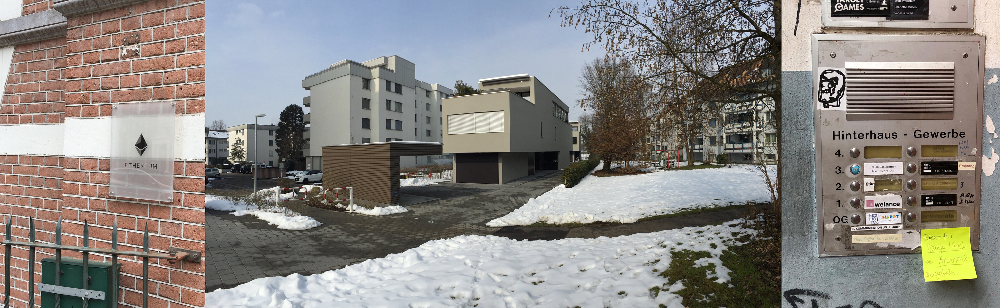
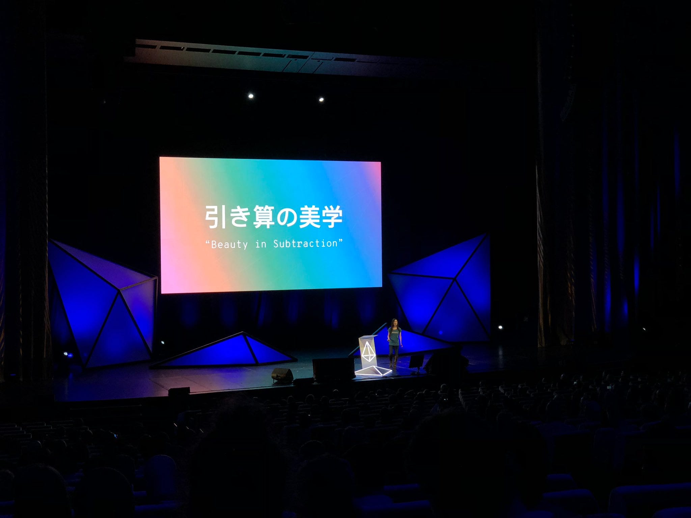

<figure>

<figcaption>The Amsterdam Office, the Zug “Boathouse” and the first Berlin Offices, where most the early teams worked at some point.</figcaption>
</figure>

Ethereum is changing, and the Ethereum Foundation is rightly changing with it.

While the high centralization of the early years of the foundation might have been crucial for Ethereum to develop and ship, it was also a great source of criticism as it was antithetical of decentralization.

At Devcon4, Aya Miyaguchi, the new Executive Director of the foundation, gave a beautiful talk clearly influenced by Zen Buddhism on her management style.

<figure>

<figcaption><a href="https://twitter.com/avsa/status/1057575687954010112">Aya at Devcon4</a></figcaption>
</figure>

Aya believes there was more value to be created by subtraction than addition. The foundation aimed to be smaller, have less power, less resources, and to do it by giving it away as grants.

No longer there would be “official” in-house teams versus external contributors, the foundation would be a financier of everyone inside and outside, and the internal teams had to compete for these resources like everyone else.

Had anyone asked me about where the foundation should go a few years prior and how it should manage their resources, I would have described exactly that model. _I know, because they did ask._ Before Aya became the director, we all had multiple conversations, both through official channels and in informal corridor meetings at conferences, to describe what everyone wanted to see the foundation become, and that was usually the answer. **Teams wanted more autonomy on their own budget, to do more experiments without having to ask permission for every new hire, or planned conference.** And that’s what they got.

Of course, there’s another side to this: if you get more autonomy, you also take more risks. And if the resources are going to more teams, there’s more competition for them

These might actually be good side effects, but they’re not easy on the receiving side. For example, for years I led the Mist team, a browser that would connect together a bunch of Ethereum technologies to create our vision for Web3. While it was used by a niche of Ethereum enthusiast, it failed any mainstream traction (well, depending on your definition of “mainstream”, no one else really reached that yet either) — and we were flooded by serious security vulnerabilities.

The team realized that, while the biggest security risks were in the browser component, there was still a lot of value on just having one single place that would help connect and manage all the different Ethereum components in one single app, which is now called [**Grid**](https://grid.ethereum.org). Meanwhile, I started to explore what were the real obstacles to mainstream adoption and started a path that I named “[**universal logins**](http://universallogin.io).” At some point I realized the Grid team would have a better chance of getting their full budget if I took myself out of their budget, so I did.

And that was it. I took myself out of any team’s budget in the Ethereum Foundation. Nobody asked me to do it, and I didn’t tell anyone other than the accounting department (and Twitter).

The foundation is quite unique in that I haven’t had a “boss” in the traditional sense in many years. You did your job, you sent an invoice to accounting, which often involves many different people and sometimes different companies in different jurisdictions, and eventually you got paid. Once a year they expect you to tell the world at Devcon what you have been doing. And once a year a different set of people will debate the budget of your team and what you’re doing. Who’s “in” the foundation and out of it is a hard distinction to make. Is it who has an ethereum-dot-org email addresses, or maybe those who get tickets to Devcon, or maybe people who have access to the Discord?

Figuring out how many people actually work at the foundation was in fact one of the first challenges Aya had to take on: it was not uncommon that some people who had active contracts would disappear for months on end into a Github project and suddenly come out of it with a three month invoice — or mabe not even that. **I personally had the case of a team member who never formally quit, was never fired, just _ghosted_ out, stopped responding, and stopped sending invoices.** It’s a weird side effect of remote work.

On that front, the new grants model is superior. It doesn’t really matter how many people worked on a given project: money goes in, code goes out. If the result isn’t good, you just stop sending money.

**In short: the foundation is moving into a grants style organization.** My old project was discontinued and I didn’t want to weigh down the new project’s chances of getting that funding by having me on their budget. And that would free more of my time to dedicate to what I think is the biggest issue on the ecosystem: user on-boarding.

#### Why does Ethereum on-boarding suck so much?

A year ago, Metamask was pretty much the only game in town on desktop. And while there was a dozen or so mobile apps, everyone was following its footsteps: for every new app, you create a new private key, backup that seed phrase, and transfer ETH into it. Rinse and repeat, every single time.

Not only is the on-boarding process usually long and complicated—you need ETH, which usually requires a credit card or an account in an exchange, which often require official documents and multiple days wait—**but you need to do it every time you install a new app!** If you already have ETH (or even BTC) the process is usually faster, but you still usually need to think about private keys, backups, etc.

In the year since [my talk in Toronto on what is now called meta-transactions](https://www.youtube.com/watch?v=qF2lhJzngto), the landscape has changed dramatically, and we’re seeing more wallets taking that challenge seriously. Even wallets that still create a private key for each user are now deferring showing the user an interface for backing it up after they’ve had some experience with it and actually own anything of value.

But still we have a main problem: **every app repeats the same on-boarding process. Trying a new app often means starting everything over.** Once a user is on-boarded on Ethereum, we need to be able to have them be able to try new apps without having to either transfer money or share their private key.

When building Mist, our challenge was always to build something for the type of geek that would install Firefox on their mom’s computer just because Internet Explorer was terrible (I hope that metaphor doesn’t age me too much). It was never the most newbie user, but someone a bit more curious and technical, which was, at the time, the least technical savvy person we could reach with the tech we had in mind.

I believe we have the tools now to reach a much wider and more audience now: of people who are outside the crypto sphere and want to try something really magical with their money. That new challenge is now [**universallogin.io**](http://universallogin.io).

Hope you follow me on that new adventure. If you’re in Berlin between 19–23 august, come catch up, I’ll be giving at least four talks:

- [**Monday 19th: Metacartel Demo day**](https://www.metacartel.org)
- [**Tuesday 20th: #BuildBetter**](https://www.eventbrite.com/e/buildbetter-how-web3-will-be-better-to-use-build-than-web2-tickets-66120820153)
- [**Wednesday 21st: Web3 Summit**](http://web3summit.com)
- [**Thursday 22nd: Dappcon**](http://dappcon.io)

---

[Where Ethereum is Going](https://blog.vandesande.design/where-ethereum-is-going) was originally published in [UniLogin](https://medium.com/universal-ethereum) on Medium, where people are continuing the conversation by highlighting and responding to this story.
